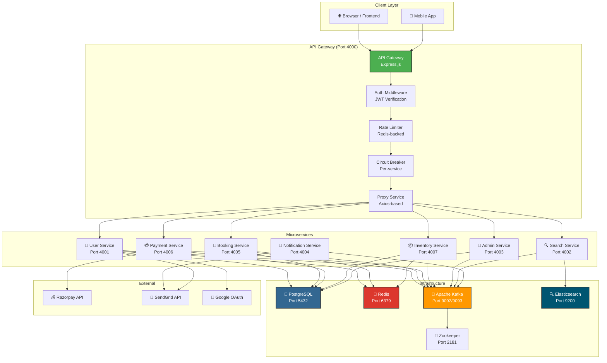
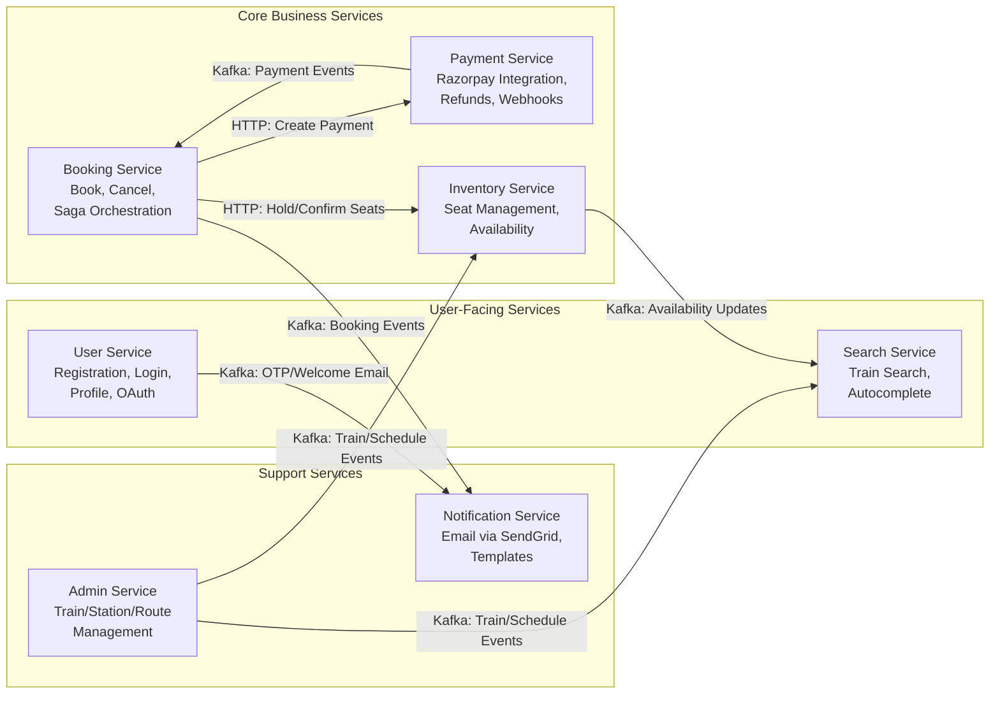
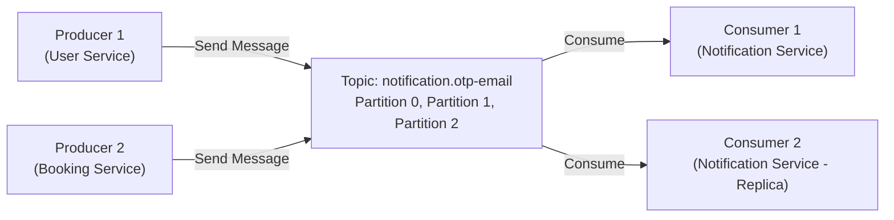
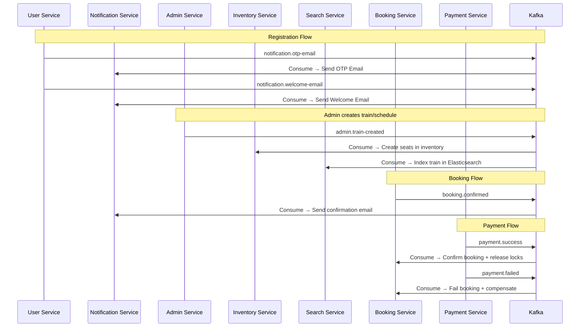
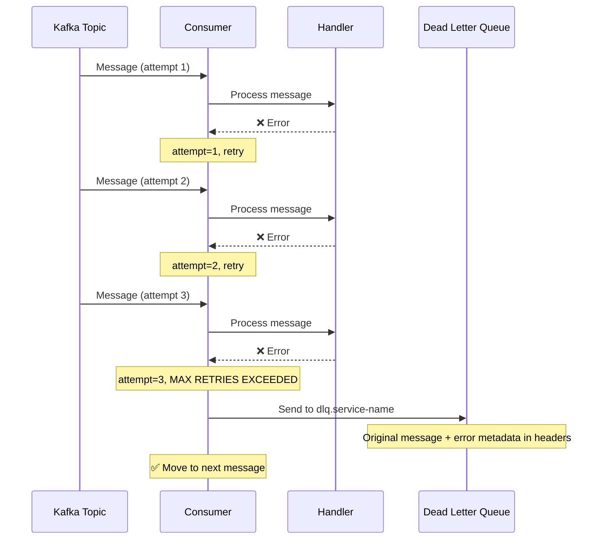
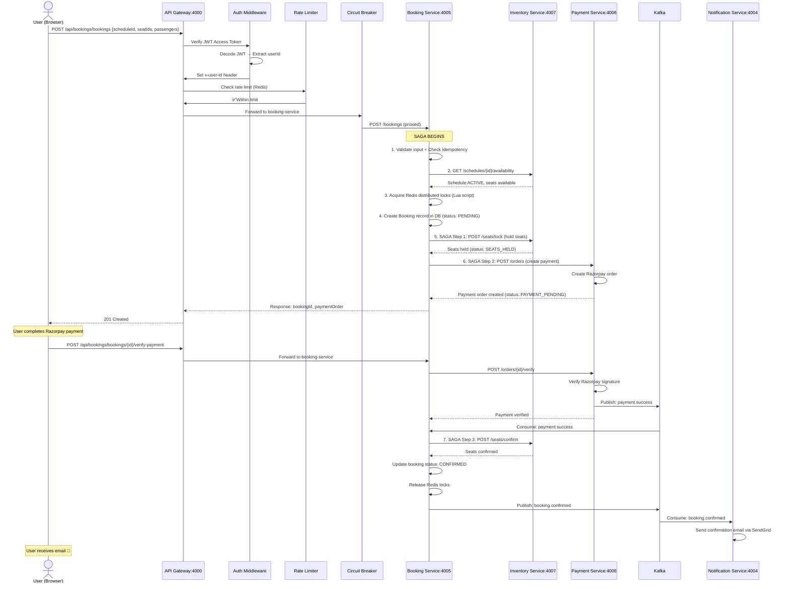

# 🏗️ IRCTC Backend — Project Overview, Architecture & Infrastructure

> **Yeh chapter poore project ki rooh hai. Agar yeh chapter samajh gaye, toh baaki sab aasan ho jayega.**

---

## Table of Contents

1. [Project Ka Purpose](#project-ka-purpose)
2. [Complete Architecture Diagram](#complete-architecture-diagram)
3. [Microservices Overview](#microservices-overview)
4. [Folder Structure Explanation](#folder-structure-explanation)
5. [Docker Compose — Infrastructure](#docker-compose--infrastructure)
6. [Shared Module — Central Constants](#shared-module--central-constants)
7. [Kafka Topics — Event Registry](#kafka-topics--event-registry)
8. [Dead Letter Queue (DLQ) Handler](#dead-letter-queue-dlq-handler)
9. [Request Lifecycle (Complete Journey)](#request-lifecycle-complete-journey)
10. [Interview Questions — Project Level](#interview-questions--project-level)

---

## Project Ka Purpose

### Kya hai yeh project?

Yeh ek **production-grade IRCTC clone** hai jo **microservice architecture** follow karta hai. Jaise real IRCTC app me train search karte ho, ticket book karte ho, payment karte ho — waisa hi sab yaha implement hai.

### Problem Statement

IRCTC jaise system me challenges hain:
- **Millions of concurrent users** (Tatkal booking time pe)
- **Double booking prevent** karna (same seat do logo ko na mile)
- **Payment failure handling** (paise kat gaye par ticket nahi mili)
- **Real-time seat availability** (search me latest data dikhna chahiye)
- **Notification** (booking confirm/cancel hone pe email)

### Technologies Used

| Technology | Purpose | Why This? |
|---|---|---|
| **Node.js** | Runtime | Event-driven, non-blocking I/O — perfect for I/O heavy microservices |
| **Express.js** | HTTP Framework | Lightweight, flexible, massive ecosystem |
| **PostgreSQL** | Primary Database | ACID compliance, complex queries, relations |
| **Prisma ORM** | Database Access | Type-safe, migrations, clean query API |
| **Redis** | Caching + Locking | In-memory speed, distributed locks, rate limiting |
| **Apache Kafka** | Message Broker | Event-driven communication between services |
| **Elasticsearch** | Search Engine | Full-text search, fast autocomplete |
| **Docker** | Containerization | Consistent environments, easy deployment |
| **Razorpay** | Payment Gateway | Indian payment processing |
| **JWT** | Authentication | Stateless authentication tokens |
| **Winston** | Logging | Structured logging with levels |

---

## Complete Architecture Diagram



### Architecture Samajhte Hain

**Client** (Browser/Mobile) → **API Gateway** ko request bhejta hai → Gateway **authenticate** karta hai (JWT check) → **Rate limit** check karta hai → **Circuit Breaker** through route karta hai → Appropriate **microservice** ko proxy karta hai.

Services aapas me do tarike se communicate karti hain:
1. **Synchronous (HTTP)**: Jab immediate response chahiye (e.g., booking service → inventory service ko seats hold karne bole)
2. **Asynchronous (Kafka)**: Jab fire-and-forget chahiye (e.g., booking confirm → notification service ko email bhejna hai)

---

## Microservices Overview

### Service Responsibility Matrix



### Har Service Ki Summary

| Service | Port | Database | Redis? | Kafka Role | Key Pattern |
|---|---|---|---|---|---|
| **API Gateway** | 4000 | ❌ | ✅ (Rate Limiting) | ❌ | Reverse Proxy + Circuit Breaker |
| **User Service** | 4001 | ✅ (users DB) | ✅ (OTP, Sessions, Cache) | Producer | OTP-based Registration + JWT Auth |
| **Search Service** | 4002 | ❌ | ❌ | Consumer | Elasticsearch-powered Search |
| **Admin Service** | 4003 | ✅ (admin DB) | ❌ | Producer | Train/Station/Route CRUD |
| **Notification Service** | 4004 | ❌ | ❌ | Consumer | SendGrid Email Templates |
| **Booking Service** | 4005 | ✅ (booking DB) | ✅ (Distributed Locks) | Producer + Consumer | Saga Pattern for Booking Lifecycle |
| **Payment Service** | 4006 | ✅ (payment DB) | ❌ | Producer | Razorpay + Webhook Handler |
| **Inventory Service** | 4007 | ✅ (inventory DB) | ✅ (Seat Locks) | Producer + Consumer | Segment-based Seat Management |

---

## Folder Structure Explanation

```
irctc-backend-main/
├── docker-compose.yml          # 🐳 Infrastructure: PostgreSQL, Redis, Kafka, ES, etc.
├── shared/                     # 📦 Common code shared across ALL services
│   ├── constants/
│   │   ├── asyncHandler.js     # Express async error handler wrapper
│   │   ├── error.js            # (empty — each service has its own)
│   │   └── kafka-topics.js     # 📋 Centralized Kafka topic registry
│   └── utils/
│       └── dlqHandler.js       # ☠️ Dead Letter Queue handler for Kafka consumers
│
├── api-gateway/                # 🚪 Entry point for all client requests
│   ├── src/
│   │   ├── index.js            # Express app setup + server start
│   │   ├── config/             # Configuration, Redis client, Logger
│   │   ├── middlewares/        # Auth, CORS, Rate Limiting, Error Handling
│   │   ├── routes/             # Route definitions + proxy mapping
│   │   ├── services/           # Proxy logic + Circuit Breaker
│   │   └── utils/              # Custom Error classes
│   └── package.json
│
├── user-service/               # 👤 User management + Authentication
│   ├── prisma/schema.prisma    # User + AuthProvider models
│   ├── src/
│   │   ├── index.js
│   │   ├── config/             # Config, Prisma, Redis, Kafka, Logger
│   │   ├── controllers/        # Auth + User controllers
│   │   ├── services/           # Auth + User business logic
│   │   ├── routes/             # Auth + User routes
│   │   ├── middlewares/        # getUserContext, internalAuth
│   │   ├── kafka/producer/     # Notification event producer
│   │   └── utils/              # OTP, JWT, Device Fingerprint, Errors
│   └── package.json
│
├── booking-service/            # 📝 Booking lifecycle management
│   ├── prisma/schema.prisma    # Booking, Seat, Passenger, SagaLog, Idempotency
│   ├── src/
│   │   ├── index.js
│   │   ├── config/
│   │   ├── controllers/
│   │   ├── services/           # booking.service, saga.service, HTTP clients
│   │   ├── routes/
│   │   ├── middlewares/
│   │   ├── kafka/              # Consumer (payment events) + Producer (booking events)
│   │   └── utils/              # Distributed Lock, Booking Expiry Job
│   └── package.json
│
├── payment-service/            # 💳 Payment processing
│   ├── prisma/schema.prisma    # PaymentOrder, Refund, AuditLog, Idempotency
│   ├── src/
│   │   ├── index.js
│   │   ├── config/
│   │   ├── controllers/        # Payment + Webhook controllers
│   │   ├── services/           # payment.service + gateways/ (Strategy Pattern)
│   │   ├── routes/             # Internal routes + Webhook route
│   │   ├── kafka/producer/     # Payment event producer
│   │   └── middlewares/
│   └── package.json
│
├── inventory-service/          # 📦 Seat availability + management
├── search-service/             # 🔍 Elasticsearch-powered search
├── notification-service/       # 📧 Email notifications
├── admin-service/              # 🔧 Admin CRUD operations
└── frontend/                   # 🎨 Frontend (React)
```

### Folder Convention — Har Service Me Same Pattern

```
service-name/
├── src/
│   ├── index.js                # Entry point — Express app, middleware chain, server start
│   ├── config/
│   │   ├── index.js            # Environment variables → config object
│   │   ├── logger.js           # Winston logger setup
│   │   ├── prisma.js           # Prisma client singleton
│   │   ├── redis.js            # Redis client singleton
│   │   └── kafka.js            # Kafka producer/consumer setup
│   ├── controllers/            # Request handling — validation + response
│   ├── services/               # Business logic — core domain operations
│   ├── routes/                 # Express route definitions
│   ├── middlewares/            # CORS, Auth, Error handling, Request logging
│   ├── kafka/
│   │   ├── producer/           # Kafka event publishers
│   │   └── consumer/           # Kafka event consumers
│   └── utils/                  # Helpers — asyncHandler, errors, etc.
├── prisma/
│   └── schema.prisma           # Database schema definition
├── package.json
└── .env.example                # Environment variable template
```

### Why This Convention?

**Interview Answer**: "Separation of Concerns (SoC) follow karte hain. Controller sirf request validate karta hai aur response format karta hai. Service me business logic hota hai. Config me environment-specific settings hoti hain. Yeh pattern har service me consistent hai, toh naya developer jab join kare, usse ek service samajhne ke baad baaki sab automatic samajh aati hain."

---

## Docker Compose — Infrastructure

### File: `docker-compose.yml`

#### Purpose
Yeh file poore project ka infrastructure define karti hai. Ek command (`docker compose up`) se saari dependencies start ho jaati hain.

#### Production Reasoning
Production me toh Kubernetes ya ECS use hoga, lekin development ke liye Docker Compose perfect hai because:
1. **Reproducible environment** — har developer ka setup same hoga
2. **Isolation** — har service apna container
3. **One command start** — `docker compose up -d`

### Line by Line Explanation

```yaml
name: irctc-backend
```
**Syntax**: Docker Compose project name. Sab containers is name ke under group honge.
**Production Reason**: Multiple projects same machine pe chal sakte hain without name conflicts.

---

#### PostgreSQL Service

```yaml
services:
  postgres:
    image: postgres:15
    container_name: postgres
    restart: always
    environment:
      POSTGRES_USER: admin
      POSTGRES_PASSWORD: irctcpass
      POSTGRES_DB: postgres
    ports:
      - "5432:5432"
    volumes:
      - postgres_data:/var/lib/postgresql/data
    networks:
      - irctc-network
```

**Kya hai PostgreSQL?**

PostgreSQL ek **Relational Database Management System (RDBMS)** hai. Think of it as an Excel sheet on steroids:
- **Tables** = Excel sheets
- **Rows** = Records
- **Columns** = Fields
- **SQL** = Language to query data

**Why PostgreSQL over MySQL?**
- **ACID compliance** — Transactions guaranteed (critical for payment!)
- **JSON support** — Store complex data structures
- **Advanced indexing** — GiST, GIN indexes for complex queries
- **Concurrent access** — MVCC (Multi-Version Concurrency Control)

**Line by Line**:

| Line | Explanation |
|---|---|
| `image: postgres:15` | Docker Hub se PostgreSQL version 15 ka image download karo |
| `container_name: postgres` | Container ko "postgres" naam do (unique identifier) |
| `restart: always` | Agar container crash ho toh automatically restart karo |
| `POSTGRES_USER: admin` | Default admin user create karo |
| `POSTGRES_PASSWORD: irctcpass` | Admin user ka password set karo |
| `POSTGRES_DB: postgres` | Default database create karo |
| `ports: "5432:5432"` | Host port 5432 → Container port 5432 map karo |
| `volumes: postgres_data:...` | **Named volume** — Data persist hoga even after container restart |
| `networks: irctc-network` | Custom Docker network me join karo |

**Interview Question**: "Volumes kyu use karte hain?"
**Answer**: "Bina volume ke, jab container restart hoga toh saara data lost ho jayega. Volume data ko host machine pe persist karta hai. Production me toh cloud-managed databases use karte hain (RDS, Cloud SQL), lekin development me volume se kaam chal jaata hai."

---

#### PgAdmin Service

```yaml
  pgadmin: 
    image: dpage/pgadmin4
    container_name: pgadmin
    environment:
      PGADMIN_DEFAULT_EMAIL: admin@admin.com
      PGADMIN_DEFAULT_PASSWORD: admin
    ports:
      - "8081:80"
    depends_on:
      - postgres
    networks:
      - irctc-network
```

**Kya hai PgAdmin?**
PgAdmin ek **GUI tool** hai PostgreSQL ko manage karne ke liye. Browser me `http://localhost:8081` pe open karke database tables, queries, etc. dekhsakte ho.

**`depends_on`**: Yeh ensure karta hai ki PgAdmin start hone se pehle PostgreSQL start ho. Lekin yeh sirf container start hone ka order define karta hai, database ready hone ka nahi.

---

#### Redis Service

```yaml
  redis:
    image: redis/redis-stack:6.2.6-v19
    container_name: redis
    restart: always
    environment:
      REDIS_ARGS: "--requirepass irctcpass"
    ports:
      - "6379:6379"
      - "8001:8001"
    volumes:
      - redis_data:/data
    networks:
      - irctc-network
```

**Kya hai Redis?**

Redis ek **in-memory data store** hai. Think of it as a super-fast dictionary (HashMap). Data RAM me store hota hai, isliye bahut fast hai.

**Is project me Redis kaha use ho raha hai:**

| Use Case | Service | Redis Key Pattern | Example |
|---|---|---|---|
| OTP Storage | User Service | `otp:session:{sessionId}` | 6-digit OTP with TTL |
| Rate Limiting | API Gateway | `ratelimit:ip:{ip}` | Sliding window counter |
| User Cache | User Service | `user:{userId}` | Avoid DB query every request |
| Refresh Token | User Service | `refresh:{userId}:{deviceId}` | JWT rotation detection |
| Distributed Lock | Booking Service | `booking:lock:seat:{scheduleId}:{seatId}` | Prevent double booking |
| Leader Election | Booking Service | `booking:expiry-job:leader` | Only one instance runs cleanup |

**Why `redis-stack` instead of plain `redis`?**
`redis-stack` includes **RedisInsight** (GUI on port 8001) + additional modules. Production me plain `redis` use karo.

**Port 8001**: RedisInsight GUI — browser me open karke Redis data dekh sakte ho.

---

#### Zookeeper Service

```yaml
  zookeeper:
    image: confluentinc/cp-zookeeper:7.5.0
    container_name: zookeeper
    restart: always
    environment:
      ZOOKEEPER_CLIENT_PORT: 2181
      ZOOKEEPER_TICK_TIME: 2000
    ports:
      - "2181:2181"
    volumes:
      - zookeeper_data:/var/lib/zookeeper/data
      - zookeeper_logs:/var/lib/zookeeper/log
    networks:
      - irctc-network
```

**Kya hai Zookeeper?**

Zookeeper ek **distributed coordination service** hai. Ise samajhne ke liye analogy:

> Imagine ek classroom me 30 students hain aur teacher (Zookeeper) decide karta hai ki kaun class monitor banega. Zookeeper bhi Kafka brokers me se ek ko "leader" banata hai.

**Zookeeper ka kaam:**
1. **Kafka Broker Registration** — Kaunse Kafka brokers alive hain
2. **Leader Election** — Kaun sa broker topic partition ka leader hai
3. **Configuration Management** — Shared config store
4. **Health Monitoring** — Broker down hua toh detect karo

**Note**: Newer Kafka versions (3.3+) me KRaft mode aaya hai jo Zookeeper ko replace karta hai. Lekin yeh project Confluent 7.5 use karta hai jo still Zookeeper-based hai.

---

#### Kafka Service

```yaml
  kafka:
    image: confluentinc/cp-kafka:7.5.0
    container_name: kafka
    restart: always
    depends_on:
      - zookeeper
    ports:
      - "9092:9092"
      - "9093:9093"
    environment:
      KAFKA_BROKER_ID: 1
      KAFKA_ZOOKEEPER_CONNECT: zookeeper:2181
      KAFKA_ADVERTISED_LISTENERS: PLAINTEXT://kafka:9092,PLAINTEXT_HOST://localhost:9093
      KAFKA_LISTENER_SECURITY_PROTOCOL_MAP: PLAINTEXT:PLAINTEXT,PLAINTEXT_HOST:PLAINTEXT
      KAFKA_INTER_BROKER_LISTENER_NAME: PLAINTEXT
      KAFKA_OFFSETS_TOPIC_REPLICATION_FACTOR: 1
      KAFKA_TRANSACTION_STATE_LOG_MIN_ISR: 1
      KAFKA_TRANSACTION_STATE_LOG_REPLICATION_FACTOR: 1
      KAFKA_AUTO_CREATE_TOPICS_ENABLE: "true"
    volumes:
      - kafka_data:/var/lib/kafka/data
    networks:
      - irctc-network
```

### 📚 Kafka Complete Teaching

**Kya hai Apache Kafka?**

Kafka ek **distributed event streaming platform** hai. Simple me:

> Post office ki tarah kaam karta hai. Koi letter (message) bhejta hai, Kafka usse store karta hai, aur jab receiver ready ho toh deliver karta hai.

**Core Concepts:**



| Concept | Explanation | Analogy |
|---|---|---|
| **Topic** | Message category | Post office ka mailbox — "OTP letters yaha dalo" |
| **Partition** | Topic ke subdivisions | Mailbox ke compartments — parallel processing ke liye |
| **Producer** | Message sender | Letter bhejne wala |
| **Consumer** | Message receiver | Letter receive karne wala |
| **Consumer Group** | Multiple consumers ek group me | Ek team jo letters process kare — workload split hota hai |
| **Offset** | Message position in partition | Receipt number — "maine yaha tak read kiya" |
| **Broker** | Kafka server | Post office branch |

**Line by Line Kafka Config:**

| Config | Value | Explanation |
|---|---|---|
| `KAFKA_BROKER_ID: 1` | Unique ID for this broker | Multi-broker setup me har broker ka alag ID hota hai |
| `KAFKA_ZOOKEEPER_CONNECT: zookeeper:2181` | Zookeeper address | Kafka ko batao Zookeeper kaha hai |
| `KAFKA_ADVERTISED_LISTENERS` | Two listeners | `PLAINTEXT://kafka:9092` = Docker network ke andar, `PLAINTEXT_HOST://localhost:9093` = Host machine se access |
| `KAFKA_OFFSETS_TOPIC_REPLICATION_FACTOR: 1` | Single replica | Production me 3 hona chahiye (fault tolerance) |
| `KAFKA_AUTO_CREATE_TOPICS_ENABLE: true` | Auto-create topics | Producer jab message bheje aur topic exist nahi kare, toh auto-create ho jaye |

**Two Ports Kyu?**
- **9092**: Docker network ke andar services communicate karte hain (e.g., `kafka:9092`)
- **9093**: Host machine se access (e.g., `localhost:9093`) — Development me Node.js process Docker ke bahar chalta hai

**Interview Question**: "Kafka me exactly-once delivery kaise guarantee karte hain?"
**Answer**: "Producer side pe `idempotent: true` set karo (duplicate messages nahi jayenge). Consumer side pe offsets manually commit karo processing ke baad. Is project me producers `idempotent: true` use karte hain."

---

#### Kafka UI

```yaml
  kafka-ui:
    image: provectuslabs/kafka-ui:latest
    container_name: kafka-ui
    restart: always
    depends_on:
      - kafka
    ports:
      - "8080:8080"
    environment:
      KAFKA_CLUSTERS_0_NAME: irctc-cluster
      KAFKA_CLUSTERS_0_BOOTSTRAPSERVERS: kafka:9092
      KAFKA_CLUSTERS_0_ZOOKEEPER: zookeeper:2181
    networks:
      - irctc-network
```

**Kya hai Kafka UI?**
Browser me `http://localhost:8080` pe Kafka topics, messages, consumers, etc. visualize kar sakte ho. Debugging ke liye bahut useful hai.

---

#### Elasticsearch + Kibana

```yaml
  elasticsearch:
    image: docker.elastic.co/elasticsearch/elasticsearch:8.12.0
    container_name: elasticsearch
    restart: always
    environment:
      - discovery.type=single-node
      - xpack.security.enabled=false
      - ES_JAVA_OPTS=-Xms512m -Xmx512m
    ports:
      - "9200:9200"
    volumes:
      - es_data:/usr/share/elasticsearch/data
    networks:
      - irctc-network

  kibana:
    image: docker.elastic.co/kibana/kibana:8.12.0
    container_name: kibana
    restart: always
    depends_on:
      - elasticsearch
    ports:
      - "5601:5601"
    environment:
      ELASTICSEARCH_HOSTS: http://elasticsearch:9200
    networks:
      - irctc-network
```

**Kya hai Elasticsearch?**

Elasticsearch ek **distributed search engine** hai. Database me `SELECT * WHERE name LIKE '%mumbai%'` slow hota hai large datasets pe. Elasticsearch **inverted index** use karta hai jo search ko milliseconds me kar deta hai.

**Is project me use:**
- Train search by name/number
- Station autocomplete
- Route search

**Key Settings:**
- `discovery.type=single-node` — Single instance (production me cluster hoga)
- `xpack.security.enabled=false` — Security off for development
- `ES_JAVA_OPTS=-Xms512m -Xmx512m` — JVM heap size limit (Elasticsearch Java pe chalta hai)

**Kibana**: Elasticsearch ka GUI. `http://localhost:5601` pe access.

---

#### Networks & Volumes

```yaml
volumes:
  postgres_data:
  redis_data:
  zookeeper_data:
  zookeeper_logs:
  kafka_data:
  es_data:

networks:
  irctc-network:
    driver: bridge
```

**Named Volumes**: Docker restart ke baad bhi data persist karte hain.

**Bridge Network**: Saare containers ek private network share karte hain. Containers ek dusre ko naam se access kar sakte hain (e.g., `postgres`, `redis`, `kafka`).

**Interview Question**: "Docker bridge network kya hota hai?"
**Answer**: "Bridge network ek virtual network hai jo Docker containers ko isolate karta hai. Containers ek dusre ko DNS name se find kar sakte hain (container name = hostname). Host machine se direct access port mapping se milta hai."

---

## Shared Module — Central Constants

### File: `shared/constants/asyncHandler.js`

#### Purpose
Yeh ek **utility wrapper** hai jo Express route handlers me `try-catch` likhne ki zarurat khatam karta hai.

#### Code

```javascript
// utils/asyncHandler.js
module.exports = fn => (req, res, next) => {
     Promise.resolve(fn(req, res, next)).catch(next);
};
```

#### Line by Line Explanation

**Line 2**: `module.exports = fn =>`
- `module.exports` = Node.js CommonJS module system — is file se kya export ho raha hai
- `fn =>` = **Higher-Order Function** — ek function jo argument me ek function leta hai

**`(req, res, next) =>`**: Return kar rahe hain ek Express middleware function (3 parameters)

**`Promise.resolve(fn(req, res, next))`**: 
- `fn(req, res, next)` — Original handler function ko call karo
- `Promise.resolve()` — Agar function async hai toh Promise return karega, agar sync hai toh bhi Promise me wrap ho jayega
- Yeh **normalization** hai — sync ya async, dono cases handle ho jayenge

**`.catch(next)`**: 
- Agar Promise reject ho (error aaye), toh `next(error)` call hoga
- Express me `next(error)` call karne se error middleware trigger hota hai

#### Without asyncHandler (Bad Way)

```javascript
exports.getProfile = async (req, res, next) => {
    try {
        const user = await userService.getProfile(req.user.id);
        res.json({ success: true, data: user });
    } catch (error) {
        next(error); // IMPORTANT: Bhoologe toh server hang ho jayega
    }
};
```

#### With asyncHandler (Good Way)

```javascript
exports.getProfile = asyncHandler(async (req, res) => {
    const user = await userService.getProfile(req.user.id);
    res.json({ success: true, data: user });
    // Error automatically caught! No try-catch needed.
});
```

#### Interview Questions

**Q: asyncHandler kyu zaroori hai?**
A: "Express by default async errors catch nahi karta. Agar async function me error throw ho aur `next(error)` call nahi kiya, toh Express ko pata hi nahi chalega error hua hai. Request hang ho jayega aur client ko timeout milega."

**Q: `Promise.resolve()` kyu lagaya?**
A: "Agar `fn` ek sync function hai jo error throw kare, toh `Promise.resolve()` ke bina woh directly throw hoga aur catch nahi hoga. `Promise.resolve()` ensure karta hai ki sync aur async dono errors handle ho."

---

## Kafka Topics — Event Registry

### File: `shared/constants/kafka-topics.js`

#### Purpose
Yeh file **poore project ka event dictionary** hai. Har Kafka topic yaha centrally define hai taaki koi service galat topic name use na kare.

#### Code

```javascript
const KAFKA_TOPICS = {
     // Notification topics (user-service -> notification-service)
     OTP_EMAIL: 'notification.otp-email',
     WELCOME_EMAIL: 'notification.welcome-email',
     BOOKING_EMAIL: 'notification.booking-email',
     PAYMENT_EMAIL: 'notification.payment-email',

     // Admin topics (admin-service -> inventory/search)
     TRAIN_CREATED: 'admin.train-created',
     STATION_CREATED: 'admin.station-created',
     ROUTE_CREATED: 'admin.route-created',
     SCHEDULE_CREATED: 'admin.schedule-created',
     TRAIN_UPDATED: 'admin.train-updated',
     STATION_UPDATED: 'admin.station-updated',
     ROUTE_UPDATED: 'admin.route-updated',
     SCHEDULE_CANCELLED: 'admin.schedule-cancelled',

     // Inventory topics (inventory-service -> search-service)
     SEAT_AVAILABILITY_UPDATED: 'inventory.seat-availability-updated',

     // Booking topics (booking-service -> notification-service)
     BOOKING_CONFIRMED: 'booking.confirmed',
     BOOKING_CANCELLED: 'booking.cancelled',
     BOOKING_FAILED: 'booking.failed',

     // Payment topics (payment-service -> booking-service)
     PAYMENT_SUCCESS: 'payment.success',
     PAYMENT_FAILED: 'payment.failed',

     // Dead-letter queues
     DLQ_BOOKING: 'dlq.booking-service',
     DLQ_INVENTORY: 'dlq.inventory-service',
     DLQ_SEARCH: 'dlq.search-service',
     DLQ_NOTIFICATION: 'dlq.notification-service',
};

const DLQ_MAX_RETRIES = 3;

module.exports = { KAFKA_TOPICS, DLQ_MAX_RETRIES };
```

#### Topic Naming Convention

Format: `{domain}.{event-name}`

| Prefix | Owner Service | Consumers |
|---|---|---|
| `notification.*` | User Service (Producer) | Notification Service (Consumer) |
| `admin.*` | Admin Service (Producer) | Inventory + Search Services (Consumer) |
| `inventory.*` | Inventory Service (Producer) | Search Service (Consumer) |
| `booking.*` | Booking Service (Producer) | Notification Service (Consumer) |
| `payment.*` | Payment Service (Producer) | Booking Service (Consumer) |
| `dlq.*` | Any Service (Producer) | Manual Investigation (Human) |

#### Kafka Message Flow Diagram



#### Why Centralized Topic Constants?

**Problem without centralization:**
```javascript
// user-service producer
producer.send({ topic: 'notification.otp-email', ... });

// notification-service consumer — TYPO!
consumer.subscribe({ topics: ['notification.otp_email'] }); // underscore instead of hyphen!
// Consumer never receives messages. Silent bug. Hours of debugging.
```

**Solution with centralization:**
```javascript
// Both services import from same source
const { KAFKA_TOPICS } = require('../../shared/constants/kafka-topics');
producer.send({ topic: KAFKA_TOPICS.OTP_EMAIL, ... });
consumer.subscribe({ topics: [KAFKA_TOPICS.OTP_EMAIL] });
// Guaranteed same string. Compile-time safety via IDE autocomplete.
```

---

## Dead Letter Queue (DLQ) Handler

### File: `shared/utils/dlqHandler.js`

#### Purpose
Jab koi Kafka message baar baar fail hota hai (poison message), toh consumer indefinitely retry karke ruk jaata hai. DLQ handler **3 retries ke baad** message ko Dead Letter Queue me bhej deta hai aur consumer aage badh jaata hai.

#### Why DLQ?

**Production Scenario:**
1. Notification Service ko ek malformed JSON message aata hai
2. `JSON.parse()` fail hota hai — error throw
3. KafkaJS same message dubara deliver karta hai (retry)
4. Phir fail. Phir retry. Phir fail.
5. **Consumer STUCK ho jaata hai** — koi aur message process nahi ho raha
6. **Saare emails ruk jaate hain** — 10 lakh users ko booking confirmation nahi milta

DLQ is problem ko solve karta hai: 3 baar try karo, phir "dlq.notification-service" topic me bhej do. Human operator baad me investigate karega.

#### Line by Line Explanation

```javascript
const { DLQ_MAX_RETRIES } = require('../constants/kafka-topics');
```
- Central constant import — `DLQ_MAX_RETRIES = 3`
- Ek jagah change karo, saari services me apply ho

```javascript
function withDLQ(producer, dlqTopic, logger, handler) {
```
- **Higher-Order Function** — ek function return karta hai
- `producer` — Kafka producer instance (DLQ topic me message bhejne ke liye)
- `dlqTopic` — Specific DLQ topic (e.g., `dlq.booking-service`)
- `logger` — Winston logger
- `handler` — Actual message processing function

```javascript
     const retryMap = new Map();
```
- **In-memory retry counter** — `topic:partition:offset` → attempt count
- Map use kiya because O(1) lookup hai
- **Important**: Yeh in-memory hai, process restart pe reset ho jayega. Production me Redis-based counter better hoga.

```javascript
     return async ({ topic, partition, message }) => {
          const msgKey = `${topic}:${partition}:${message.offset}`;
          const attempt = (retryMap.get(msgKey) || 0) + 1;
          retryMap.set(msgKey, attempt);
```
- Unique key banao message ke liye
- Previous attempt count lo (default 0) + 1
- Updated count store karo

```javascript
          let parsedValue;
          try {
               parsedValue = JSON.parse(message.value.toString());
          } catch (parseErr) {
               // Completely unparseable — send to DLQ immediately
               await sendToDLQ(producer, dlqTopic, topic, partition, message, parseErr, logger);
               retryMap.delete(msgKey);
               return;
          }
```
- Pehle message parse karo
- Agar parse hi nahi ho raha (malformed JSON), toh retry ka koi faayda nahi — **seedha DLQ me bhej do**
- Retry map se cleanup karo

```javascript
          try {
               await handler({ topic, partition, message, parsedValue });
               // Success — clean up
               retryMap.delete(msgKey);
          } catch (error) {
               if (attempt >= DLQ_MAX_RETRIES) {
                    await sendToDLQ(producer, dlqTopic, topic, partition, message, error, logger);
                    retryMap.delete(msgKey);
               } else {
                    throw error; // Re-throw so KafkaJS retries
               }
          }
```
- Handler successfully process kare → cleanup
- Handler fail kare:
  - `attempt >= 3` → **DLQ me bhej do**, consumer aage badhe
  - `attempt < 3` → **Re-throw** karo, KafkaJS automatically retry karega

```javascript
async function sendToDLQ(producer, dlqTopic, originalTopic, partition, message, error, logger) {
     try {
          await producer.send({
               topic: dlqTopic,
               messages: [{
                    key: message.key,
                    value: message.value,
                    headers: {
                         ...message.headers,
                         'dlq-original-topic': originalTopic,
                         'dlq-original-partition': String(partition),
                         'dlq-original-offset': message.offset,
                         'dlq-error': error.message,
                         'dlq-timestamp': new Date().toISOString(),
                    },
               }],
          });
```
- Original message ko DLQ topic me publish karo
- **Headers me metadata** add karo — debugging ke liye crucial:
  - Kaun se topic se aaya tha?
  - Kaun si partition me tha?
  - Kya error tha?
  - Kab hua?

```javascript
     } catch (dlqError) {
          // If even the DLQ publish fails, log and move on
          logger.error(`Failed to send message to DLQ ${dlqTopic}`, { ... });
     }
```
- **Critical Design Decision**: Agar DLQ me bhejne me bhi fail ho, toh silently log karo aur aage badho
- Alternative: Consumer block kar do — lekin tab bhi saare messages ruk jayenge, worse problem hai

#### DLQ Flow Diagram



#### Interview Questions

**Q: DLQ kya hota hai?**
A: "Dead Letter Queue ek special topic/queue hai jaha woh messages jaate hain jo baar baar fail ho rahe hain (poison messages). Instead of blocking the consumer forever, hum message ko DLQ me move kar dete hain aur consumer aage badh jaata hai. Later ek operator ya automated process DLQ messages investigate karta hai."

**Q: In-memory retryMap ka kya problem hai?**
A: "Process restart hone pe counter reset ho jayega. Distributed environment me har instance ka apna counter hoga. Better approach: Redis-based counter ya Kafka consumer offset management."

**Q: `crypto.timingSafeEqual` kyu use kiya instead of `===`?**
A: "Timing attack prevention. `===` fast return karta hai jab first character mismatch ho, attacker is timing difference se correct characters guess kar sakta hai. `timingSafeEqual` constant-time comparison karta hai."

---

## Request Lifecycle (Complete Journey)

### User Books a Train Ticket — Full Flow



---

## Interview Questions — Project Level

### Easy

**Q: Microservice architecture kya hai?**
A: "Application ko chote, independent services me todna jaha har service ek specific business capability handle karti hai. Har service independently deploy, scale, aur maintain ho sakti hai."

**Q: Monolith vs Microservice kab choose kare?**
A: "Small team, early stage → Monolith. Large team, complex domain, different scaling needs → Microservices. Is project me alag services isliye bani kyunki User management, Booking, Payment — inke scaling needs alag hain."

### Medium

**Q: Services aapas me kaise communicate karti hain?**
A: "Do ways se:
1. **Synchronous (HTTP)** — Jab immediate response chahiye, jaise booking service ko inventory se seats hold karwani hain
2. **Asynchronous (Kafka)** — Jab fire-and-forget chahiye, jaise booking confirm hone pe email bhejni hai"

**Q: API Gateway kyu use kiya?**
A: "Single entry point provide karta hai clients ke liye. Authentication, Rate Limiting, Circuit Breaking sab centrally handle hota hai. Client ko internal service architecture ka pata nahi hota."

### Hard

**Q: Saga pattern kyu use kiya distributed transactions ke liye?**
A: "Microservices me traditional ACID transactions kaam nahi karti kyunki data alag databases me hai. Saga pattern me har step ke saath compensation (rollback) step define hota hai. Agar step 3 fail ho, toh step 2 aur step 1 reverse karo."

**Q: Exactly-once processing Kafka me kaise achieve kiya?**
A: "Producer side: `idempotent: true`. Consumer side: Processing ke baad hi offset commit karo. Idempotency keys use karo service level pe — agar same message dobara aaye toh detect karo."

### Senior

**Q: Double booking kaise prevent kar rahe ho?**
A: "Three-layer protection:
1. **Redis Distributed Locks** (Lua script — all-or-nothing) — First line of defense
2. **Database optimistic locking** (version field + CAS) — Second line
3. **Idempotency keys** — Third line — same request dobara aaye toh cached response de do"

**Q: System me booking expire hone ka mechanism kya hai?**
A: "Background job (`setInterval`) har 30 seconds run hota hai. Redis leader election se ensure karta hai ki multi-instance environment me sirf ek instance cleanup kare. Expired bookings ko CAS (Compare-And-Swap) se atomically EXPIRED mark karta hai, saga steps compensate karta hai, aur Kafka pe event publish karta hai."

---

> **Next Chapter**: [01 — API Gateway Deep Dive](./01_api_gateway.md) — Gateway ke har file ka line-by-line explanation
