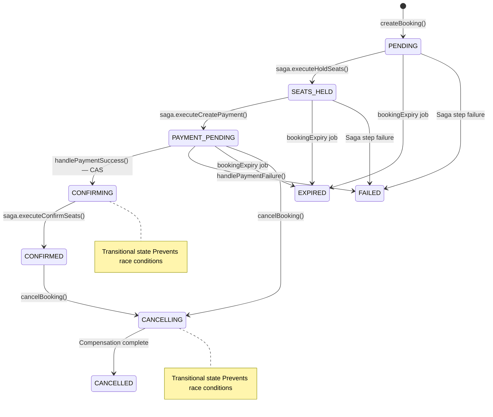
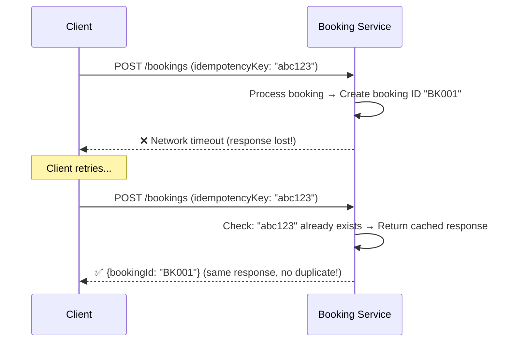
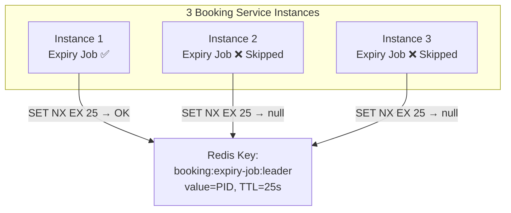
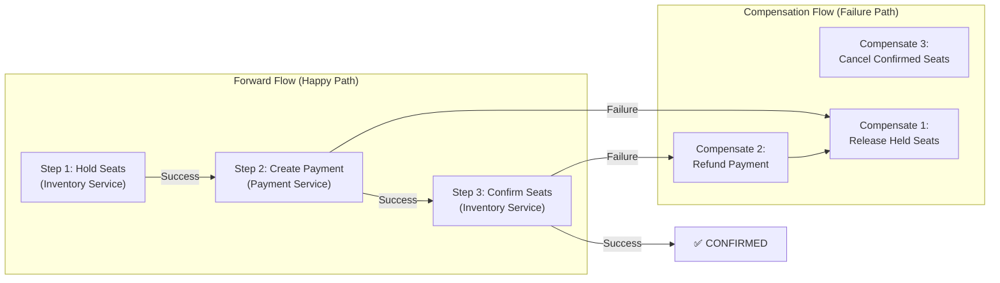
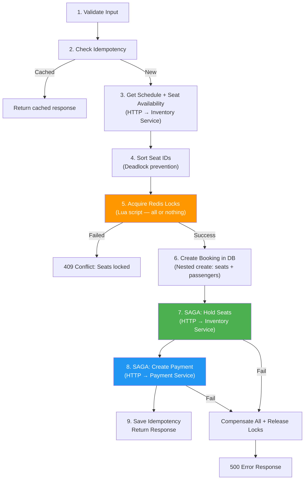

# 📝 Booking Service — Complete Deep Dive

> **Booking Service poore project ka dil hai. Yaha pe Saga Pattern, Distributed Locking, Optimistic Concurrency Control — sab advanced concepts ek saath implement hain.**

---

## Table of Contents

1. [Booking Service Kya Karta Hai?](#booking-service-kya-karta-hai)
2. [Prisma Schema — Database Design](#prisma-schema--database-design)
3. [config/index.js — Environment Configuration](#configindexjs--environment-configuration)
4. [config/kafka.js — Producer + Consumer Setup](#configkafkajs--producer--consumer-setup)
5. [config/redis.js — Distributed Lock Support](#configredisjs--distributed-lock-support)
6. [utils/error.js — Custom Errors + StaleStateError](#utilserrorjs--custom-errors--stalestaterror)
7. [utils/distributedLock.js — Redis Lua Scripts](#utilsdistributedlockjs--redis-lua-scripts)
8. [utils/bookingExpiry.js — Background Job + Leader Election](#utilsbookingexpiryjs--background-job--leader-election)
9. [services/inventoryClient.js — HTTP Client with Retry](#servicesinventoryclientjs--http-client-with-retry)
10. [services/paymentClient.js — Payment HTTP Client](#servicespaymentclientjs--payment-http-client)
11. [services/userClient.js — User Lookup Client](#servicesuserclientjs--user-lookup-client)
12. [services/stationClient.js — Station Client + In-Memory Cache](#servicesstationclientjs--station-client--in-memory-cache)
13. [services/saga.service.js — Saga Orchestrator](#servicessagaservicejs--saga-orchestrator)
14. [services/booking.service.js — Core Business Logic](#servicesbookingservicejs--core-business-logic)
15. [kafka/producer/booking.producer.js — Event Publisher](#kafkaproducerbookingproducerjs--event-publisher)
16. [kafka/consumer/booking.consumer.js — Event Consumer](#kafkaconsumerbookingconsumerjs--event-consumer)
17. [controllers/booking.controller.js — Request Handler](#controllersbookingcontrollerjs--request-handler)
18. [routes/booking.route.js — Route Definitions](#routesbookingroutejs--route-definitions)
19. [index.js — Service Entry Point](#indexjs--service-entry-point)
20. [Complete Booking Lifecycle](#complete-booking-lifecycle)
21. [Interview Questions — Booking Service](#interview-questions--booking-service)

---

## Booking Service Kya Karta Hai?

### Responsibilities

1. **Create Booking** — User seats select karke booking banata hai
2. **Hold Seats** — Seats ko temporarily lock karo (Redis + Inventory)
3. **Payment Coordination** — Payment service ko order create karne bolo
4. **Confirm Booking** — Payment success pe seats permanently assign karo
5. **Cancel Booking** — User ya system dwara booking cancel + refund
6. **Expire Bookings** — Time-out bookings ko clean up karo
7. **Handle Schedule Cancellation** — Admin ne train cancel ki → sab bookings cancel

### Key Design Patterns Used

| Pattern | Where | Why |
|---|---|---|
| **Saga Pattern** | `saga.service.js` | Distributed transactions across services |
| **Distributed Lock** | `distributedLock.js` | Prevent double booking (Redis Lua scripts) |
| **Optimistic Concurrency** | `casUpdateBooking()` | Race condition prevention without DB locks |
| **Idempotency** | `checkIdempotency()` | Duplicate request handling |
| **Leader Election** | `bookingExpiry.js` | Single-instance background jobs |
| **Circuit Breaker** | Gateway level | Downstream service failure handling |
| **Compensating Transaction** | `saga.compensateAll()` | Rollback on partial failure |

---

## Prisma Schema — Database Design

```prisma
enum BookingStatus {
  PENDING           // Booking created, nothing held yet
  SEATS_HELD        // Seats held in inventory
  PAYMENT_PENDING   // Payment order created, waiting for user payment
  CONFIRMING        // Payment received, confirming seats
  CONFIRMED         // Booking complete, seats assigned permanently
  CANCELLING        // Cancellation in progress
  FAILED            // Something went wrong
  CANCELLED         // User or system cancelled
  EXPIRED           // Payment timeout
}
```

### Booking Status State Machine



### Why Transitional States (CONFIRMING, CANCELLING)?

**Problem without CONFIRMING:**
```
Time T0: Payment webhook arrives → status = PAYMENT_PENDING
Time T1: Expiry job runs → status = PAYMENT_PENDING (same!)
          Expiry job: "Hmm, PAYMENT_PENDING + expired → expire it"
          Payment handler: "Hmm, PAYMENT_PENDING → confirm it"
          RACE CONDITION! Both modify the booking.
```

**Solution with CONFIRMING:**
```
Time T0: Payment handler uses CAS to atomically:
         PAYMENT_PENDING → CONFIRMING (version 1 → 2)
Time T1: Expiry job tries CAS:
         PAYMENT_PENDING (version 1) → EXPIRED
         But version is now 2 → CAS FAILS → Expiry job skips
         ✅ No race condition!
```

### Booking Model

```prisma
model Booking {
  id             String        @id @default(uuid())
  userId         String
  scheduleId     String
  trainId        String
  trainNumber    String
  trainName      String
  departureDate  DateTime      @db.Date
  status         BookingStatus @default(PENDING)
  totalAmount    Float         @default(0)
  seatCount      Int
  fromStationId  String?       // Segment booking: boarding station
  toStationId    String?       // Segment booking: alighting station
  fromSeq        Int?          // Route sequence of boarding station
  toSeq          Int?          // Route sequence of alighting station
  idempotencyKey String        @unique
  paymentOrderId String?       @unique
  lockExpiresAt  DateTime?
  failureReason  String?
  version        Int           @default(0)  // Optimistic locking
  
  seats      BookingSeat[]
  passengers Passenger[]
  sagaLog    SagaLog[]

  @@index([userId])
  @@index([scheduleId])
  @@index([status])
  @@index([lockExpiresAt, status])  // Composite index for expiry job
}
```

### Key Fields Explained

| Field | Type | Purpose | Why Important? |
|---|---|---|---|
| `idempotencyKey` | String @unique | Same request duplicate detect karo | Network retry pe duplicate booking prevent |
| `paymentOrderId` | String? @unique | Payment service ka order ID | Null until payment step, unique to prevent double payment |
| `lockExpiresAt` | DateTime? | Booking kab expire hogi | Expiry job is field pe filter karta hai |
| `version` | Int @default(0) | **Optimistic lock counter** | CAS (Compare-And-Swap) operations me use hota hai |
| `fromSeq`, `toSeq` | Int? | Segment booking support | Same train, different stations |

### What is Segment Booking?

```
Train Route: Delhi (seq=1) → Agra (seq=2) → Jaipur (seq=3) → Mumbai (seq=4)

Passenger A: Delhi → Mumbai (seq 1-4) — Full route, Seat 1A
Passenger B: Delhi → Agra (seq 1-2) — Only first segment, Seat 2B
Passenger C: Agra → Mumbai (seq 2-4) — Seat 2B (SAME seat as B, no conflict!)

Without segment booking: Seat 2B would be blocked for entire route.
With segment booking: Seat 2B available for non-overlapping segments.
```

### SagaLog Model

```prisma
model SagaLog {
  id        String         @id @default(uuid())
  bookingId String
  step      SagaStep       // HOLD_SEATS, CREATE_PAYMENT, CONFIRM_SEATS
  status    SagaStepStatus // PENDING, COMPLETED, COMPENSATED, FAILED
  request   Json?          // What was sent to downstream service
  response  Json?          // What was received back
  error     String?        // Error message if failed
}
```

**Purpose**: 
- Debugging: "Booking fail hua, kaun sa step fail hua?"
- Crash recovery: Server restart ke baad dekho kaun se steps complete hue the
- Audit: Compliance ke liye record rakhna

### IdempotencyRecord Model

```prisma
model IdempotencyRecord {
  id          String   @id @default(uuid())
  eventKey    String   @unique
  response    Json?          // Cached response
  processedAt DateTime @default(now())
}
```

**Why Idempotency?**



---

## utils/distributedLock.js — Redis Lua Scripts

### 📚 Distributed Locking Complete Teaching

**Problem: Double Booking**

```
Time T0: User A selects Seat 1A, clicks "Book"
Time T0: User B selects Seat 1A, clicks "Book"
Time T1: User A's request reaches server → checks availability → Seat 1A available ✅
Time T1: User B's request reaches server → checks availability → Seat 1A available ✅
Time T2: User A's request creates booking for Seat 1A
Time T2: User B's request creates booking for Seat 1A
RESULT: Same seat sold twice! 💀
```

**Solution: Lock the seat BEFORE checking availability**

```
Time T0: User A → Try to acquire lock on Seat 1A → SUCCESS ✅
Time T0: User B → Try to acquire lock on Seat 1A → FAIL ❌ (already locked)
User B gets immediate error: "Seat being booked by another user"
```

### Why Redis? Why Not Database Lock?

| Feature | Database Lock | Redis Lock |
|---|---|---|
| Speed | ~5-10ms | ~0.5-1ms |
| Scalability | Limited by DB connections | Scales horizontally |
| Auto-expiry | Need manual cleanup | Built-in TTL |
| Atomicity | Requires transaction | Lua script = atomic |
| Cross-service | Same DB required | Any service can lock |

### Lua Script — Why?

```
Problem: Check + Set is NOT atomic
Command 1: SETNX key value → Check if key exists
Command 2: EXPIRE key 600 → Set TTL
Between command 1 and 2, another process might interfere!

Solution: Lua script runs atomically on Redis server
```

### ACQUIRE_SCRIPT — All-or-Nothing Lock

```lua
local lockValue = ARGV[1]       -- Booking ID + timestamp
local ttl = tonumber(ARGV[2])   -- Lock TTL in seconds
local acquired = {}              -- Track acquired locks

for i, key in ipairs(KEYS) do   -- Loop through all seat lock keys
    local result = redis.call('SET', key, lockValue, 'NX', 'EX', ttl)
    if not result then
        -- ROLLBACK: Release all previously acquired locks
        for j = 1, #acquired do
            redis.call('DEL', acquired[j])
        end
        return 0  -- Failure
    end
    table.insert(acquired, key)
end

return 1  -- All locks acquired
```

**Line by Line Explanation:**

```lua
local lockValue = ARGV[1]
```
- `ARGV` — Arguments passed to Lua script
- `lockValue` = `"bookingId:timestamp"` — Lock ownership identifier

```lua
local ttl = tonumber(ARGV[2])
```
- TTL in seconds (default 600 = 10 minutes)
- `tonumber()` — Lua me string → number convert karo

```lua
for i, key in ipairs(KEYS) do
```
- `KEYS` — Redis keys passed to Lua script
- `ipairs()` — Lua ka "indexed pairs" iterator
- Keys = `["booking:lock:seat:schedule1:seat1", "booking:lock:seat:schedule1:seat2"]`

```lua
    local result = redis.call('SET', key, lockValue, 'NX', 'EX', ttl)
```
- `SET key value NX EX ttl`
- `NX` = **Not Exists** — Sirf tab set karo jab key exist nahi karti
- `EX ttl` = Expire after `ttl` seconds
- Returns `OK` on success, `nil` on failure (key already exists)

```lua
    if not result then
        for j = 1, #acquired do
            redis.call('DEL', acquired[j])
        end
        return 0
```
- **All-or-Nothing**: Agar koi ek seat lock nahi hua → pehle ke sab locks release karo
- Return 0 = failure

### RELEASE_SCRIPT — Ownership Check

```lua
local lockValue = ARGV[1]
local released = 0

for i, key in ipairs(KEYS) do
    local currentValue = redis.call('GET', key)
    if currentValue == lockValue then
        redis.call('DEL', key)
        released = released + 1
    end
end

return released
```

**Why ownership check?**
```
Time T0: User A acquires lock (value = "A:123")
Time T1: Lock expires (TTL up)
Time T2: User B acquires same lock (value = "B:456")
Time T3: User A's slow response tries to release lock
         Without ownership check: User A releases User B's lock! 💀
         With ownership check: "A:123" != "B:456" → Skip → Safe ✅
```

### Lock Key Pattern

```javascript
function buildLockKeys(scheduleId, seatIds, fromSeq, toSeq) {
     const suffix = (fromSeq && toSeq) ? `:${fromSeq}:${toSeq}` : '';
     return [...seatIds]
          .sort()
          .map(seatId => `booking:lock:seat:${scheduleId}:${seatId}${suffix}`);
}
```

**Without segment**: `booking:lock:seat:SCH001:SEAT001`
**With segment**: `booking:lock:seat:SCH001:SEAT001:1:3` (fromSeq=1, toSeq=3)

**Why sort?**
```
Thread 1: Lock Seat A, then Seat B
Thread 2: Lock Seat B, then Seat A
→ DEADLOCK! Thread 1 holds A, waits for B. Thread 2 holds B, waits for A.

Solution: Always sort → Both threads lock A first, then B.
→ No deadlock possible.
```

### forceReleaseSeatLocks — No Ownership Check

```javascript
async function forceReleaseSeatLocks(scheduleId, seatIds, fromSeq, toSeq) {
     const keys = buildLockKeys(scheduleId, seatIds, fromSeq, toSeq);
     if (keys.length > 0) {
          await redis.del(...keys);
     }
}
```

**When to use force release?**
- Booking expired → Lock owner is no longer relevant
- Booking confirmed → Inventory has permanent record, lock not needed
- Booking cancelled → Compensation complete, cleanup locks

---

## utils/bookingExpiry.js — Background Job + Leader Election

### 📚 Complete Teaching

**Problem:**
User ne booking create ki, payment ke liye Razorpay page gaya, aur waha se bhaag gaya (ya internet band ho gaya). Ab seats locked hain lekin koi payment nahi aayega. Seats permanently blocked ho jayengi.

**Solution:** Background job jo har 30 seconds check kare: "Koi booking hai jiska `lockExpiresAt` time beet chuka hai?"

### Leader Election — Multi-Instance Problem



**Without Leader Election:**
- 3 instances = 3 cleanup jobs running simultaneously
- Same expired booking ko teeno process karne lagenge
- Compensate calls 3 baar jayenge → Inventory confused!

**With Leader Election (Redis SET NX EX):**
- Only ONE instance gets the lock per cycle
- Others skip this cycle
- Lock TTL (25s) < interval (30s) → Lock re-acquired each cycle

```javascript
const LEADER_KEY = 'booking:expiry-job:leader';
const LEADER_TTL_SECONDS = 25; // shorter than interval

async function tryAcquireLeadership() {
     const result = await redis.set(
          LEADER_KEY, 
          process.pid.toString(), 
          'NX',  // Not Exists — only if no leader
          'EX',  // Expire
          LEADER_TTL_SECONDS
     );
     return result === 'OK';
}
```

**`process.pid`** — Process ID as lock value. Debugging me pata chalega kaun sa instance leader tha.

### cleanExpiredBookings — The Cleanup Logic

```javascript
async function cleanExpiredBookings() {
     const isLeader = await tryAcquireLeadership();
     if (!isLeader) return; // Skip if not leader

     const expiredBookings = await prisma.booking.findMany({
          where: {
               status: { in: ['PENDING', 'SEATS_HELD', 'PAYMENT_PENDING'] },
               lockExpiresAt: { lt: new Date() },
          },
          include: { seats: true },
     });
```

**Database Query**: "Sab bookings laao jo:
1. Status = PENDING ya SEATS_HELD ya PAYMENT_PENDING (active but not confirmed)
2. lockExpiresAt < current time (expired)

```javascript
     for (const booking of expiredBookings) {
          const seatIds = booking.seats.map(s => s.seatId).sort();

          // CAS: Atomically claim this booking
          const claimed = await prisma.booking.updateMany({
               where: {
                    id: booking.id,
                    version: booking.version,
                    status: { in: ['PENDING', 'SEATS_HELD', 'PAYMENT_PENDING'] },
               },
               data: {
                    status: 'EXPIRED',
                    failureReason: 'booking_timeout',
                    version: { increment: 1 },
               },
          });

          if (claimed.count === 0) continue; // Another process handled it

          await compensateAll(booking, seatIds);
          await forceReleaseSeatLocks(...);
          await bookingProducer.publishBookingFailed({
               reason: 'booking_timeout',
               ...
          });
     }
```

**Why CAS here?**

Between the time we queried (`findMany`) and tried to update, payment webhook might have arrived and changed the status. CAS ensures:
- If `version` matches → We "own" this transition → Update succeeds
- If `version` changed → Someone else handled it → `count = 0` → Skip

### Interval Setup

```javascript
function startBookingExpiryJob() {
     cleanExpiredBookings(); // Run immediately once
     expiryInterval = setInterval(cleanExpiredBookings, config.BOOKING_EXPIRY_CHECK_INTERVAL_MS);
}

function stopBookingExpiryJob() {
     if (expiryInterval) {
          clearInterval(expiryInterval);
     }
}
```

- `setInterval` — Har 30 seconds (default) run karo
- `clearInterval` — Graceful shutdown pe band karo
- First run immediate — Server start hone pe turant check karo

---

## services/saga.service.js — Saga Orchestrator

### 📚 Saga Pattern Complete Teaching

**Problem: Distributed Transactions**

Monolith me:
```sql
BEGIN TRANSACTION;
  INSERT INTO bookings (...);      -- Step 1
  UPDATE inventory SET locked=true; -- Step 2
  INSERT INTO payments (...);       -- Step 3
COMMIT; -- All or nothing
```

Microservices me:
- Booking DB ≠ Inventory DB ≠ Payment DB
- Traditional ACID transaction impossible across databases!

**Solution: Saga Pattern**

> Saga = ek sequence of local transactions + compensation steps



**Two Types of Saga:**
1. **Choreography** — Services independently react to events (event-driven)
2. **Orchestration** — Central coordinator tells services what to do ← **This project uses this**

### Forward Steps

#### Step 1: executeHoldSeats

```javascript
async function executeHoldSeats(booking, seatIds, ttlSeconds, fromSeq, toSeq) {
     // 1. Create SagaLog entry (PENDING)
     const sagaLog = await prisma.sagaLog.create({
          data: {
               bookingId: booking.id,
               step: 'HOLD_SEATS',
               status: 'PENDING',
               request: { scheduleId, seatIds, userId, ttlSeconds, fromSeq, toSeq },
          },
     });

     try {
          // 2. Call Inventory Service HTTP API
          const result = await inventoryClient.holdSeats(
               booking.scheduleId, seatIds, booking.userId, ttlSeconds, fromSeq, toSeq
          );

          // 3. Update SagaLog (COMPLETED)
          await prisma.sagaLog.update({
               where: { id: sagaLog.id },
               data: { status: 'COMPLETED', response: result },
          });

          // 4. Update Booking status
          await prisma.booking.update({
               where: { id: booking.id },
               data: { status: 'SEATS_HELD' },
          });

          return result;
     } catch (error) {
          // 5. Update SagaLog (FAILED)
          await prisma.sagaLog.update({
               where: { id: sagaLog.id },
               data: { status: 'FAILED', error: errorMsg },
          });
          throw error;
     }
}
```

**Pattern**: Every saga step follows same template:
1. Create SagaLog (PENDING) — Audit trail
2. Call downstream service
3. Success → SagaLog (COMPLETED) + Update booking status
4. Failure → SagaLog (FAILED) + Re-throw error

#### Step 2: executeCreatePayment

```javascript
async function executeCreatePayment(booking) {
     const idempotencyKey = `${booking.id}-payment`;
     // ... same pattern as above ...
     const result = await paymentClient.createPaymentOrder(
          booking.id, booking.totalAmount, booking.userId, idempotencyKey
     );
     // Update booking: status = PAYMENT_PENDING, paymentOrderId = result.paymentOrderId
}
```

**Idempotency Key**: `"booking-abc123-payment"` — Agar same booking ke liye dubara payment create karne ki koshish ho, Payment Service detect kar legi.

#### Step 3: executeConfirmSeats

```javascript
async function executeConfirmSeats(booking, seatIds, fromSeq, toSeq) {
     // Called after payment success (Kafka consumer)
     const result = await inventoryClient.confirmSeats(
          booking.scheduleId, seatIds, booking.userId, booking.id, fromSeq, toSeq
     );
     // SagaLog → COMPLETED
}
```

### Compensation Steps (Reverse Order)

```javascript
async function compensateAll(booking, seatIds) {
     // Get all COMPLETED saga steps in REVERSE chronological order
     const completedSteps = await prisma.sagaLog.findMany({
          where: { bookingId: booking.id, status: 'COMPLETED' },
          orderBy: { createdAt: 'desc' }, // REVERSE!
     });

     for (const step of completedSteps) {
          switch (step.step) {
               case 'CONFIRM_SEATS':
                    await compensateConfirmSeats(booking); // Cancel confirmed seats
                    break;
               case 'CREATE_PAYMENT':
                    await compensateCreatePayment(booking); // Initiate refund
                    break;
               case 'HOLD_SEATS':
                    await compensateHoldSeats(booking, seatIds); // Release held seats
                    break;
          }
     }
}
```

**Why Reverse Order?**
```
Forward:  HOLD_SEATS → CREATE_PAYMENT → CONFIRM_SEATS
Reverse:  CONFIRM_SEATS → CREATE_PAYMENT → HOLD_SEATS

If we compensated in forward order:
1. Release seats first → seats become available
2. Meanwhile refund hasn't started → money still with us
3. Another user books those seats → money collected twice!

Reverse order: Undo last action first → safe.
```

### Compensation Details

| Step | Forward Action | Compensation |
|---|---|---|
| HOLD_SEATS | Lock seats in inventory | Release seats (`inventoryClient.releaseSeats`) |
| CREATE_PAYMENT | Create Razorpay order | Initiate refund (`paymentClient.initiateRefund`) |
| CONFIRM_SEATS | Permanently assign seats | Cancel booking in inventory (`inventoryClient.cancelBooking`) |

**Graceful Degradation:**
```javascript
async function compensateHoldSeats(booking, seatIds) {
     try {
          await inventoryClient.releaseSeats(...);
          await prisma.sagaLog.updateMany({ ..., data: { status: 'COMPENSATED' } });
     } catch (error) {
          logger.error(`Failed to compensate HOLD_SEATS...`);
          // Inventory lock expiry will eventually clean this up
     }
}
```
- Compensation fail bhi ho sakta hai (inventory service down)
- Log karo, move on — inventory ke TTL-based locks eventually expire honge
- **Self-healing**: System eventually consistent ho jayega

---

## services/booking.service.js — Core Business Logic (827 Lines)

### casUpdateBooking — Optimistic Lock Helper

```javascript
const casUpdateBooking = async (bookingId, expectedVersion, data) => {
     const result = await prisma.booking.updateMany({
          where: { id: bookingId, version: expectedVersion },
          data: { ...data, version: { increment: 1 } },
     });

     if (result.count === 0) {
          throw new StaleStateError(
               `Booking ${bookingId} was modified by another process`
          );
     }
};
```

### 📚 CAS (Compare-And-Swap) Complete Teaching

**Analogy:**
> Wikipedia editing ki tarah. Tum article edit kar rahe ho (version 5 dekh rahe ho). Jab save karo → Wikipedia check kare: "Current version still 5 hai?" Agar haan → save. Agar kisi ne beech me edit kar diya (version 6 ho gayi) → "Edit conflict, please reload."

**In Code:**
```
Time T0: Thread A reads booking (version = 3)
Time T0: Thread B reads booking (version = 3)
Time T1: Thread A: UPDATE WHERE version = 3 → SUCCESS (version → 4)
Time T1: Thread B: UPDATE WHERE version = 3 → FAIL (count = 0, version is now 4)
Thread B: StaleStateError → "Someone else modified this booking"
```

**Why `updateMany` instead of `update`?**
- `update` throws if no record matches the `where` clause
- `updateMany` returns `{ count: 0 }` if no match — we can handle it gracefully
- No try-catch needed for the "not found" case

### createBooking — The Master Function

This is the most complex function in the entire project. Let's break it down:

```javascript
const createBooking = async (userId, scheduleId, seatIds, passengers, 
                              idempotencyKey, fromStationId, toStationId, 
                              fromSeq, toSeq) => {
```

**Step 1: Validate Input**
```javascript
     if (!scheduleId || !seatIds || !Array.isArray(seatIds) || seatIds.length === 0)
          throw new BadRequestError('...');
     if (seatIds.length !== passengers.length)
          throw new BadRequestError('Number of seats must match number of passengers');
     if (fromSeq && toSeq && fromSeq >= toSeq)
          throw new BadRequestError('fromStation must come before toStation in route');
```

**Step 2: Check Idempotency**
```javascript
     const cached = await checkIdempotency(`booking:${idempotencyKey}`);
     if (cached) return cached; // Return cached response for duplicate request
```

**Step 3: Verify Schedule + Seats**
```javascript
     const availability = await inventoryClient.getAvailability(scheduleId);
     if (availability.status !== 'ACTIVE') throw new BadRequestError('Schedule not active');
     if (new Date(availability.departureDate) < new Date()) 
          throw new BadRequestError('Cannot book departed train');

     const seatData = await inventoryClient.getSeats(scheduleId, { fromSeq, toSeq });
     const seatMap = new Map(seatData.seats.map(s => [s.seatId, s]));

     for (const seatId of seatIds) {
          const seat = seatMap.get(seatId);
          if (!seat) throw new NotFoundError(`Seat ${seatId} not found`);
          const isAvailable = (fromSeq && toSeq && seat.segmentStatus !== undefined)
               ? seat.segmentStatus === 'AVAILABLE'
               : seat.status === 'AVAILABLE';
          if (!isAvailable) throw new ConflictError('Seat not available');
          totalAmount += seat.price;
     }
```

**Step 4: Sort SeatIds (Deadlock Prevention)**
```javascript
     const sortedSeatIds = [...seatIds].sort();
```

**Step 5: Acquire Redis Distributed Locks**
```javascript
     const { acquired, lockValue } = await acquireSeatLocks(
          scheduleId, sortedSeatIds, `pre-${Date.now()}`,
          config.BOOKING_TTL_SECONDS, fromSeq, toSeq
     );
     if (!acquired) throw new ConflictError('Seats being booked by another user');
```

**Step 6: Create Booking in Database**
```javascript
     booking = await prisma.booking.create({
          data: {
               userId, scheduleId, trainId, trainNumber, trainName,
               departureDate, status: 'PENDING', totalAmount, seatCount,
               fromStationId, toStationId, fromSeq, toSeq,
               idempotencyKey, lockExpiresAt,
               seats: { create: bookingSeats.map(...) },
               passengers: { create: passengers.map(...) },
          },
          include: { seats: true, passengers: true },
     });
```

**Prisma Nested Create**: Booking + Seats + Passengers ek transaction me create hote hain.

**Step 7: Saga Step 1 — Hold Seats**
```javascript
     await saga.executeHoldSeats(booking, sortedSeatIds, config.LOCK_TTL_SECONDS, fromSeq, toSeq);
```

**Step 8: Saga Step 2 — Create Payment**
```javascript
     const paymentOrder = await saga.executeCreatePayment(booking);
```

**Step 9: Save Idempotency + Return Response**
```javascript
     await saveIdempotency(`booking:${idempotencyKey}`, response);
     return response;
```

**Catch Block — Compensation on Failure**
```javascript
     } catch (error) {
          if (booking) {
               await saga.compensateAll(booking, sortedSeatIds);
               await prisma.booking.update({
                    where: { id: booking.id },
                    data: { status: 'FAILED', failureReason: error.message },
               });
          }
          await releaseSeatLocks(scheduleId, sortedSeatIds, lockValue, fromSeq, toSeq);
          throw error;
     }
```

### Complete createBooking Flow



### handlePaymentSuccess — Kafka Consumer Handler

```javascript
const handlePaymentSuccess = async (paymentOrderId, gatewayPaymentId, amount) => {
     const booking = await prisma.booking.findUnique({ where: { paymentOrderId } });
     
     if (!booking) return;
     if (booking.status === 'CONFIRMED') return; // Already confirmed (idempotent)
     if (booking.status !== 'PAYMENT_PENDING') return; // Unexpected state

     const seatIds = booking.seats.map(s => s.seatId).sort();

     // CAS: Atomically claim this booking (PAYMENT_PENDING → CONFIRMING)
     await casUpdateBooking(booking.id, booking.version, { status: 'CONFIRMING' });

     // Saga Step 3: Confirm seats permanently
     await saga.executeConfirmSeats(booking, seatIds, booking.fromSeq, booking.toSeq);

     // Final: CONFIRMING → CONFIRMED
     await prisma.booking.updateMany({
          where: { id: booking.id, status: 'CONFIRMING' },
          data: { status: 'CONFIRMED', version: { increment: 1 } },
     });

     // Release Redis locks
     await forceReleaseSeatLocks(booking.scheduleId, seatIds);

     // Publish BOOKING_CONFIRMED → Notification Service
     await bookingProducer.publishBookingConfirmed({ ... });
};
```

**Three-Way Race Prevention:**
```
Payment webhook → handlePaymentSuccess() → CONFIRMING
Expiry job → cleanExpiredBookings() → EXPIRED
User cancel → cancelBooking() → CANCELLING

All three use CAS on the same booking.
Only ONE will succeed. Others will get StaleStateError and skip.
```

### cancelBooking — User Cancellation

```javascript
const cancelBooking = async (bookingId, userId) => {
     const booking = await prisma.booking.findUnique({ where: { id: bookingId } });
     
     if (!booking || booking.userId !== userId) throw new NotFoundError('...');
     if (['CANCELLED', 'CANCELLING', 'FAILED', 'EXPIRED', 'CONFIRMING'].includes(booking.status))
          throw new ConflictError('Already in terminal state');

     // CAS: Claim this booking (→ CANCELLING)
     await casUpdateBooking(booking.id, booking.version, {
          status: 'CANCELLING', failureReason: 'user_cancelled'
     });

     if (booking.status === 'CONFIRMED') {
          // Cancel confirmed: release seats in inventory + refund
          await inventoryClient.cancelBooking(...);
          if (booking.paymentOrderId) {
               await paymentClient.initiateRefund(...);
          }
     } else if (['PAYMENT_PENDING', 'SEATS_HELD'].includes(booking.status)) {
          // Cancel pre-payment: just release held seats
          await inventoryClient.releaseSeats(...);
     }

     // CANCELLING → CANCELLED
     await prisma.booking.updateMany({
          where: { id: booking.id, status: 'CANCELLING' },
          data: { status: 'CANCELLED', version: { increment: 1 } },
     });

     // Release locks + Publish BOOKING_CANCELLED
};
```

**CAS Rollback on Inventory Failure:**
```javascript
if (booking.status === 'CONFIRMED') {
     try {
          await inventoryClient.cancelBooking(...);
     } catch (error) {
          // Roll back CANCELLING → CONFIRMED so user can retry
          await prisma.booking.updateMany({
               where: { id: booking.id, status: 'CANCELLING' },
               data: { status: 'CONFIRMED', failureReason: null, version: { increment: 1 } },
          });
          throw error;
     }
}
```

**Why rollback?** Agar inventory service down hai aur seats release nahi ho rahi, toh booking ko CANCELLED mark karna galat hoga (seats still blocked). User ko retry karne do jab inventory service wapas aaye.

### handleScheduleCancelled — Admin Action

```javascript
const handleScheduleCancelled = async (scheduleId) => {
     const activeBookings = await prisma.booking.findMany({
          where: {
               scheduleId,
               status: { in: ['PENDING', 'SEATS_HELD', 'PAYMENT_PENDING', 'CONFIRMED'] },
          },
     });

     for (const booking of activeBookings) {
          // CAS: Claim each booking atomically
          const claimed = await prisma.booking.updateMany({
               where: { id: booking.id, version: booking.version, status: { in: [...] } },
               data: { status: 'CANCELLED', failureReason: 'schedule_cancelled' },
          });

          if (claimed.count === 0) continue; // Already handled

          // Release locks, refund confirmed bookings, publish events
     }
};
```

---

## HTTP Clients — Inter-Service Communication

### services/inventoryClient.js

```javascript
const client = axios.create({
     baseURL: config.INVENTORY_SERVICE_URL,
     timeout: 10000,
     headers: {
          'Content-Type': 'application/json',
          'x-internal-service-key': config.INTERNAL_SERVICE_KEY,
     },
});
```

**`x-internal-service-key`**: Service-to-service authentication. Inventory Service checks this header to ensure only internal services can call it, not external users.

### withRetry — Exponential Backoff

```javascript
async function withRetry(fn, maxRetries = 3) {
     let lastError;
     for (let attempt = 1; attempt <= maxRetries; attempt++) {
          try {
               return await fn();
          } catch (error) {
               lastError = error;
               const status = error.response?.status;
               // Don't retry 4xx (client errors) — user mistake, won't fix itself
               if (status && status >= 400 && status < 500) throw error;

               if (attempt < maxRetries) {
                    const delay = 200 * Math.pow(2, attempt - 1);
                    // delay: 200ms, 400ms, 800ms (exponential backoff)
                    await new Promise(resolve => setTimeout(resolve, delay));
               }
          }
     }
     throw lastError;
}
```

**Why not retry 4xx?**
- 400 Bad Request → Our request is wrong, retrying won't help
- 401 Unauthorized → Token invalid, retrying won't fix
- 404 Not Found → Resource doesn't exist

**Why retry 5xx?**
- 500 Internal Server Error → Maybe temporary bug
- 503 Service Unavailable → Maybe restarting
- Network timeout → Maybe momentary network glitch

**Exponential Backoff**: `200ms → 400ms → 800ms` — Gradually increase wait time to give service recovery time.

### services/stationClient.js — In-Memory Cache

```javascript
const STATION_CACHE_TTL_MS = 10 * 60 * 1000; // 10 minutes
const stationCache = new Map();

function cacheGet(stationId) {
     const entry = stationCache.get(stationId);
     if (!entry) return null;
     if (Date.now() > entry.expiresAt) {
          stationCache.delete(stationId);
          return null;
     }
     return entry.value;
}
```

**Why in-memory cache for stations?**
- Station names rarely change
- Called during every booking confirmation (notification enrichment)
- Redis call ka 1ms bhi bachao
- 10-minute TTL ensures eventual consistency

---

## Kafka Producer + Consumer

### BookingProducer — Retry + Timestamp

```javascript
class BookingProducer {
     async sendMessage(topic, key, value) {
          for (let attempt = 1; attempt <= MAX_PUBLISH_RETRIES; attempt++) {
               try {
                    return await producer.send({
                         topic,
                         messages: [{
                              key: key || `${topic}-${Date.now()}`,
                              value: JSON.stringify(value),
                              timestamp: Date.now().toString(),
                         }],
                    });
               } catch (error) {
                    if (attempt < MAX_PUBLISH_RETRIES) {
                         await new Promise(r => setTimeout(r, RETRY_DELAY_MS * attempt));
                    }
               }
          }
          throw lastError; // All retries failed
     }

     async publishBookingConfirmed(data) {
          return this.sendMessage(
               KAFKA_TOPICS.BOOKING_CONFIRMED,
               `booking-${data.bookingId}`,
               { ...data, confirmedAt: new Date().toISOString() }
          );
     }
}
```

**Message Key**: `"booking-BK001"` — Same booking ke messages same Kafka partition me jayenge. Ordering guaranteed within partition.

### BookingConsumer — Topic Routing

```javascript
await consumer.subscribe({
     topics: [
          KAFKA_TOPICS.PAYMENT_SUCCESS,     // Payment service ne payment confirm kiya
          KAFKA_TOPICS.PAYMENT_FAILED,      // Payment fail hua
          KAFKA_TOPICS.SCHEDULE_CANCELLED,  // Admin ne schedule cancel kiya
     ],
     fromBeginning: false,
});

await consumer.run({
     eachMessage: withDLQ(producer, KAFKA_TOPICS.DLQ_BOOKING, logger, 
          async ({ topic, partition, message, parsedValue }) => {
               switch (topic) {
                    case KAFKA_TOPICS.PAYMENT_SUCCESS:
                         await bookingService.handlePaymentSuccess(...);
                         break;
                    case KAFKA_TOPICS.PAYMENT_FAILED:
                         await bookingService.handlePaymentFailure(...);
                         break;
                    case KAFKA_TOPICS.SCHEDULE_CANCELLED:
                         await bookingService.handleScheduleCancelled(...);
                         break;
               }
          }
     ),
});
```

**`fromBeginning: false`** — Old messages ignore karo, sirf naye messages process karo. Restart pe purane messages dobara process nahi honge.

---

## Interview Questions — Booking Service

### Easy

**Q: Booking service ka primary responsibility kya hai?**
A: "Booking lifecycle manage karna — create, hold seats, coordinate payment, confirm, cancel, aur expire. Yeh Saga orchestrator hai jo multiple services ko coordinate karta hai."

### Medium

**Q: Double booking kaise prevent karte ho?**
A: "Three layers:
1. **Redis Distributed Lock** (Lua script, all-or-nothing) — First defense
2. **Optimistic Concurrency Control** (version field + CAS) — Database level
3. **Idempotency Keys** — Request level duplicate detection"

**Q: Saga pattern me compensation kaise kaam karta hai?**
A: "Har forward step ka ek reverse step hota hai. Agar step 3 fail ho toh step 2 aur step 1 reverse me undo karo. SagaLog table me har step track hota hai — crash recovery possible."

### Hard

**Q: Payment success aur booking expiry simultaneously aaye toh?**
A: "CAS (Compare-And-Swap) handle karta hai. Both try to update the booking, but WHERE clause me `version` check hota hai. Sirf ek succeed karega — dusra `count = 0` get karega aur skip karega."

**Q: Distributed lock me Lua script kyu use kiya Redis command ke jagah?**
A: "Atomicity. Individual Redis commands ke beech me race condition ho sakti hai. Lua script Redis server pe atomically execute hota hai — koi dusra command beech me nahi aa sakta."

**Q: Deadlock kaise prevent kar rahe ho?**
A: "Seat IDs sort karte hain lock acquire karne se pehle. Toh agar Thread A seats [B, A] maange aur Thread B seats [A, B] maange, dono sorted order me [A, B] lock karenge. Deadlock impossible."

### Senior

**Q: Leader election for expiry job — kya problem ho sakti hai?**
A: "In-memory `setInterval` based hai. Split-brain possible agar Redis temporarily unreachable ho — multiple instances run kar sakte hain. Better approach: Redis Redlock algorithm ya dedicated job scheduler (Bull, Agenda)."

**Q: Segment booking me overlapping segments ka conflict kaise detect hote hain?**
A: "Redis lock keys me `fromSeq:toSeq` suffix hota hai. Non-overlapping segments different keys get karte hain (no conflict). Overlapping segments alag keys bhi get kar sakte hain — final conflict detection Inventory Service ka DB transaction handle karta hai (FOR UPDATE NOWAIT)."

---

> **Next Chapter**: [03 — Payment Service Deep Dive](./03_payment_service.md)
