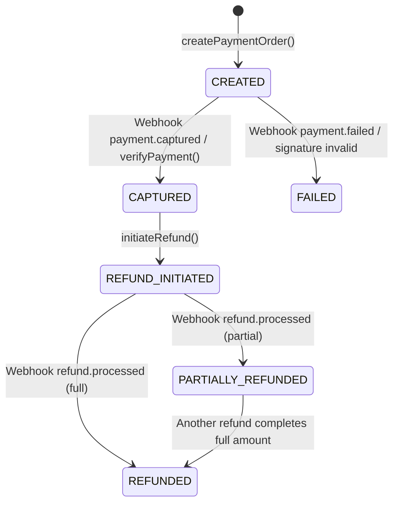
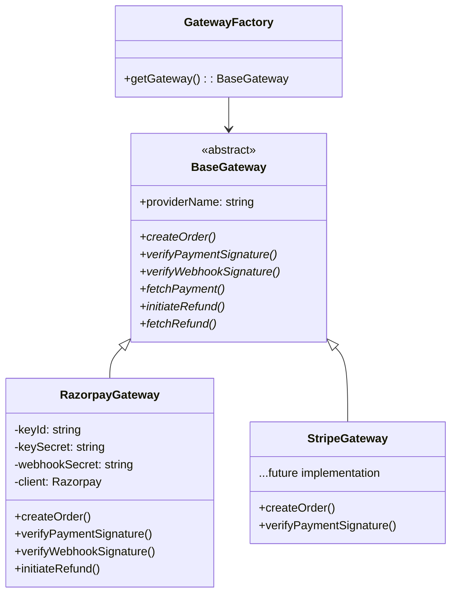
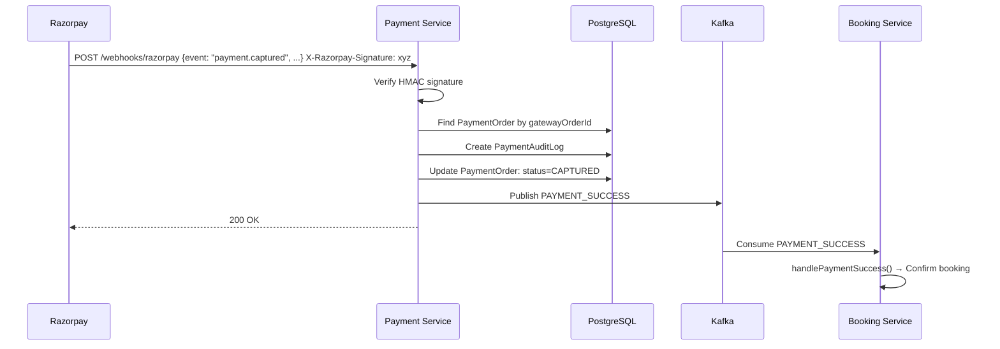
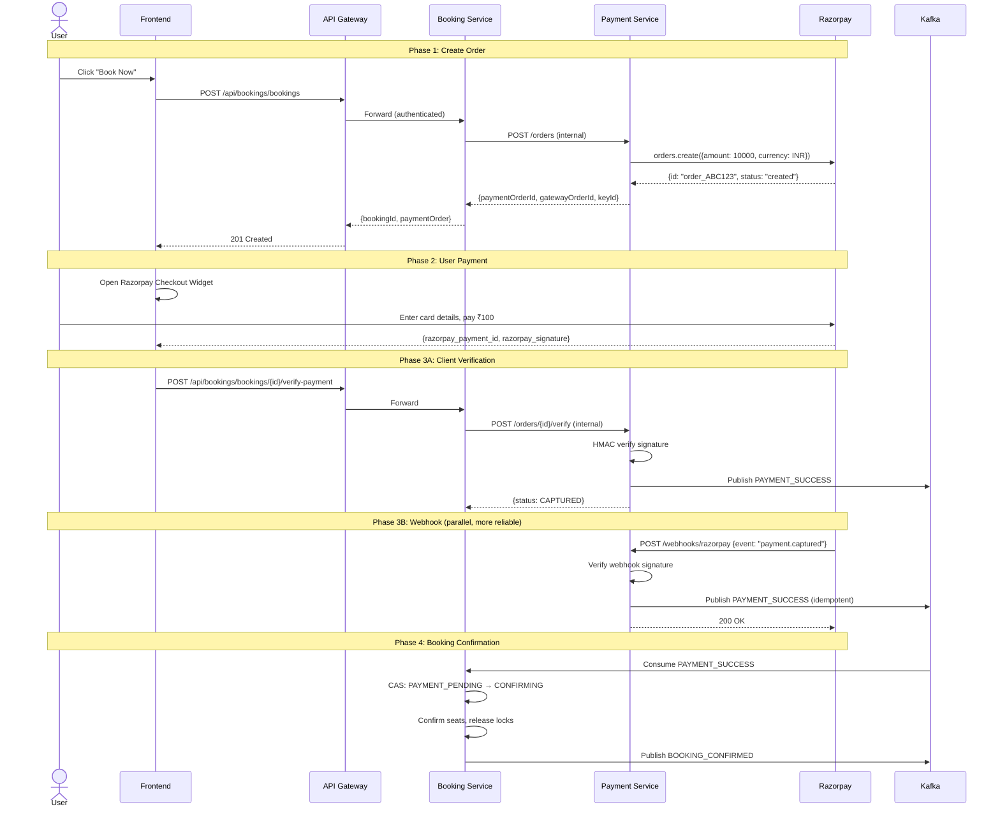

# 💳 Payment Service — Complete Deep Dive

> **Payment Service wo service hai jaha paise handle hote hain. Ek bug yaha = real money loss. Isliye yeh service sabse carefully designed hai.**

---

## Table of Contents

1. [Payment Service Kya Karta Hai?](#payment-service-kya-karta-hai)
2. [Prisma Schema — Database Design](#prisma-schema--database-design)
3. [Design Patterns Used](#design-patterns-used)
4. [Gateway Pattern — Strategy + Factory](#gateway-pattern--strategy--factory)
5. [services/payment.service.js — Core Logic](#servicespaymentservicejs--core-logic)
6. [Webhook Handling — Raw Body + Signature](#webhook-handling--raw-body--signature)
7. [Kafka Producer — Payment Events](#kafka-producer--payment-events)
8. [Routes — Internal vs Public](#routes--internal-vs-public)
9. [Complete Payment Flow](#complete-payment-flow)
10. [Interview Questions — Payment Service](#interview-questions--payment-service)

---

## Payment Service Kya Karta Hai?

| Responsibility | Description |
|---|---|
| **Create Payment Order** | Razorpay pe order create karo (amount, currency, receipt) |
| **Verify Payment** | Client-side: Razorpay signature verify karo |
| **Handle Webhooks** | Server-side: Razorpay events process karo (payment.captured, payment.failed) |
| **Initiate Refund** | Razorpay pe refund initiate karo |
| **Audit Logging** | Har action ka record rakhna (compliance ke liye) |
| **Publish Events** | Kafka pe PAYMENT_SUCCESS / PAYMENT_FAILED publish karo |

### Key Principle: Payment Is Write-Heavy + Audit-Critical

```
Every rupee must be traceable:
  Who initiated? → userId, bookingId
  When? → timestamps
  What happened? → audit logs with gateway responses
  What went wrong? → failureReason + error logs
```

---

## Prisma Schema — Database Design

```prisma
enum PaymentOrderStatus {
  CREATED              // Order created in Razorpay
  CAPTURED             // Payment successfully captured
  FAILED               // Payment failed
  REFUND_INITIATED     // Refund started
  REFUNDED             // Full refund complete
  PARTIALLY_REFUNDED   // Partial refund done
}

model PaymentOrder {
  id               String             @id @default(uuid())
  bookingId        String
  userId           String
  amount           Float
  currency         String             @default("INR")
  status           PaymentOrderStatus @default(CREATED)
  idempotencyKey   String             @unique
  gatewayProvider  String             @default("razorpay")
  gatewayOrderId   String?            @unique   // Razorpay order_id
  gatewayPaymentId String?            @unique   // Razorpay payment_id
  gatewaySignature String?                       // Razorpay signature
  failureReason    String?
  metadata         Json?
  version          Int                @default(0)
  
  auditLogs PaymentAuditLog[]
  refunds   Refund[]
}

model Refund {
  id              String       @id @default(uuid())
  paymentOrderId  String
  amount          Float
  reason          String?
  status          RefundStatus @default(INITIATED)
  idempotencyKey  String       @unique
  gatewayRefundId String?      @unique
}

model PaymentAuditLog {
  id              String   @id @default(uuid())
  paymentOrderId  String
  action          String           // ORDER_CREATED, WEBHOOK_PAYMENT_CAPTURED, etc.
  gatewayResponse Json?            // Full Razorpay response stored as JSON
  metadata        Json?
}
```

### Payment Status State Machine



### Why PaymentAuditLog?

**Compliance requirement**: Financial regulators require full audit trail of every payment action. Agar dispute aaye (customer claims "mujhe refund nahi mila"), toh audit log se exact gateway response dikha sakte ho.

**Each audit log captures:**
- `action`: What happened (ORDER_CREATED, SIGNATURE_VERIFIED, etc.)
- `gatewayResponse`: Raw Razorpay API response (JSON)
- `metadata`: Additional context (userId, amount, etc.)

---

## Design Patterns Used

### Strategy Pattern — Payment Gateway Abstraction



### Why This Pattern?

```
Today: India → Razorpay
Tomorrow: International expansion → Stripe
Day after: Southeast Asia → GrabPay

Without Strategy Pattern:
  - if (gateway === 'razorpay') { ... } 
  - else if (gateway === 'stripe') { ... }
  - 100 places me if-else lagao, each with different API calls

With Strategy Pattern:
  - const gateway = getGateway(); // Returns correct implementation
  - gateway.createOrder(amount, currency); // Same interface, different internals
  - ZERO changes in business logic when adding new gateway
```

---

## Gateway Pattern — Strategy + Factory

### base.gateway.js — Abstract Base Class

```javascript
class BaseGateway {
     constructor(providerName) {
          if (new.target === BaseGateway) {
               throw new Error('BaseGateway is abstract and cannot be instantiated directly');
          }
          this.providerName = providerName;
     }

     async createOrder(amount, currency, receipt, notes = {}) {
          throw new Error('createOrder() must be implemented by gateway');
     }

     verifyPaymentSignature(orderId, paymentId, signature) {
          throw new Error('verifyPaymentSignature() must be implemented');
     }

     verifyWebhookSignature(rawBody, signature) {
          throw new Error('verifyWebhookSignature() must be implemented');
     }

     async initiateRefund(paymentId, amount, notes = {}) {
          throw new Error('initiateRefund() must be implemented');
     }
}
```

**`new.target` Trick:**
```javascript
if (new.target === BaseGateway) {
     throw new Error('Cannot instantiate abstract class');
}
```
- `new.target` tells you which constructor was called
- `new BaseGateway()` → `new.target === BaseGateway` → ERROR
- `new RazorpayGateway()` → `new.target === RazorpayGateway` → OK
- JavaScript me native abstract classes nahi hain, yeh workaround hai

**Method Stubs:**
- Har method `throw new Error()` karta hai
- Subclass override na kare toh runtime pe clear error milega
- "Contract" define kar rahe hain — "tujhe yeh sab implement karna padega"

### razorpay.gateway.js — Concrete Implementation

```javascript
class RazorpayGateway extends BaseGateway {
     constructor(keyId, keySecret, webhookSecret) {
          super('razorpay');
          this.keyId = keyId;
          this.keySecret = keySecret;
          this.webhookSecret = webhookSecret;
          this.client = new Razorpay({ key_id: keyId, key_secret: keySecret });
     }
```

#### createOrder — INR to Paise Conversion

```javascript
     async createOrder(amount, currency, receipt, notes = {}) {
          const amountInPaise = Math.round(amount * 100);
```
- **Critical**: Razorpay amounts hote hain paise me (₹100 = 10000 paise)
- `Math.round()` — Floating point issues avoid karo
  - `100 * 100 = 10000` ✅
  - `99.99 * 100 = 9999.000000001` ← Without round, this fails

```javascript
          const order = await this.client.orders.create({
               amount: amountInPaise,
               currency,          // "INR"
               receipt,           // bookingId (unique reference)
               notes,             // { bookingId, userId } — metadata
          });

          return {
               gatewayOrderId: order.id,    // "order_ABC123"
               amount: order.amount / 100,  // Convert back to rupees
               currency: order.currency,
               receipt: order.receipt,
               rawResponse: order,          // Full Razorpay response (for audit)
          };
```

#### verifyPaymentSignature — HMAC SHA256

```javascript
     verifyPaymentSignature(orderId, paymentId, signature) {
          const body = `${orderId}|${paymentId}`;
          const expectedSignature = crypto
               .createHmac('sha256', this.keySecret)
               .update(body)
               .digest('hex');

          return crypto.timingSafeEqual(
               Buffer.from(expectedSignature, 'hex'),
               Buffer.from(signature, 'hex')
          );
     }
```

### 📚 HMAC Signature Verification — Complete Teaching

**Problem:**
Client ne payment complete kiya. Ab server ko kaise pata chalega ki payment GENUINE hai aur kisi ne tamper nahi kiya?

**Solution: HMAC (Hash-based Message Authentication Code)**

```
Step 1: Razorpay creates payment → sends orderId + paymentId + signature to client
Step 2: Client sends these three values to OUR server
Step 3: Server independently calculates expected signature:
        body = "order_ABC123|pay_XYZ456"
        expected = HMAC-SHA256(body, our_secret_key)
Step 4: Compare expected vs received signature
        Match → Payment genuine ✅
        Mismatch → Tampered ❌
```

**`crypto.timingSafeEqual()` kyu?**
```
Normal comparison (===):
  "abc" === "xyz" → Fails at 1st character (fast)
  "abc" === "abd" → Fails at 3rd character (slower)
  Attacker measures time → Guesses correct characters one by one!
  This is called a TIMING ATTACK.

timingSafeEqual:
  Always takes same time regardless of where mismatch is.
  Attacker can't extract any information from timing.
```

#### verifyWebhookSignature — Different Secret

```javascript
     verifyWebhookSignature(rawBody, signature) {
          const body = typeof rawBody === 'string' ? rawBody : rawBody.toString('utf8');
          const expectedSignature = crypto
               .createHmac('sha256', this.webhookSecret)  // Different secret!
               .update(body)
               .digest('hex');
```

**Key difference:**
- `verifyPaymentSignature` uses `keySecret` (for client-side verification)
- `verifyWebhookSignature` uses `webhookSecret` (for server-to-server webhook)
- Two different secrets for two different trust boundaries

#### initiateRefund

```javascript
     async initiateRefund(paymentId, amount, notes = {}) {
          const amountInPaise = Math.round(amount * 100);
          const refund = await this.client.payments.refund(paymentId, {
               amount: amountInPaise,
               notes,
          });

          return {
               gatewayRefundId: refund.id,  // "rfnd_ABC123"
               status: refund.status,
               amount: refund.amount / 100,
               rawResponse: refund,
          };
     }
```

### gateway.factory.js — Factory Pattern

```javascript
let gatewayInstance = null; // Singleton

function getGateway() {
     if (gatewayInstance) return gatewayInstance;

     const provider = config.PAYMENT_GATEWAY; // "razorpay" from .env

     switch (provider) {
          case 'razorpay':
               gatewayInstance = new RazorpayGateway(
                    config.RAZORPAY_KEY_ID,
                    config.RAZORPAY_KEY_SECRET,
                    config.RAZORPAY_WEBHOOK_SECRET
               );
               break;
          // case 'stripe':
          //      gatewayInstance = new StripeGateway(config.STRIPE_KEY, ...);
          //      break;
          default:
               throw new Error(`Unknown gateway: ${provider}`);
     }

     return gatewayInstance;
}
```

**Adding new gateway (e.g., Stripe):**
1. Create `stripe.gateway.js` extending `BaseGateway`
2. Add `case 'stripe'` in factory
3. Set `PAYMENT_GATEWAY=stripe` in `.env`
4. **ZERO changes in `payment.service.js`** ← Power of Strategy Pattern

---

## services/payment.service.js — Core Logic

### Idempotency Wrapper

```javascript
const withIdempotency = async (key, fn) => {
     const existing = await prisma.idempotencyRecord.findUnique({ where: { eventKey: key } });
     if (existing) {
          logger.info(`Idempotent request: ${key}`);
          return existing.response; // Return cached response
     }

     const result = await fn(); // Execute the actual logic

     await prisma.idempotencyRecord.create({
          data: { eventKey: key, response: result },
     });

     return result;
};
```

**Higher-order function**: Wraps any operation with idempotency check.

**Usage:**
```javascript
return withIdempotency(`payment-order:${idempotencyKey}`, async () => {
     // This code runs ONLY ONCE per idempotencyKey
     const gateway = getGateway();
     const gatewayResult = await gateway.createOrder(...);
     // ...
});
```

### createPaymentOrder

```javascript
const createPaymentOrder = async (bookingId, amount, userId, idempotencyKey) => {
     // 1. Validation
     if (!bookingId || !amount || !userId || !idempotencyKey) throw ...;
     if (amount <= 0) throw ...;

     return withIdempotency(`payment-order:${idempotencyKey}`, async () => {
          // 2. Create order in Razorpay
          const gateway = getGateway();
          const gatewayResult = await gateway.createOrder(amount, 'INR', bookingId, {
               bookingId, userId,
          });

          // 3. Create record in our database
          const paymentOrder = await prisma.paymentOrder.create({
               data: {
                    bookingId, userId, amount, currency: 'INR',
                    status: 'CREATED', idempotencyKey,
                    gatewayProvider: config.PAYMENT_GATEWAY,
                    gatewayOrderId: gatewayResult.gatewayOrderId,
               },
          });

          // 4. Create audit log
          await prisma.paymentAuditLog.create({
               data: {
                    paymentOrderId: paymentOrder.id,
                    action: 'ORDER_CREATED',
                    gatewayResponse: gatewayResult.rawResponse,
                    metadata: { bookingId, userId, amount },
               },
          });

          // 5. Return to booking service
          return {
               paymentOrderId: paymentOrder.id,
               gatewayOrderId: gatewayResult.gatewayOrderId,
               amount, currency: 'INR',
               keyId: config.RAZORPAY_KEY_ID, // Frontend needs this for Razorpay checkout
          };
     });
};
```

**Why return `keyId`?**
Frontend Razorpay checkout widget ko `key_id` chahiye:
```javascript
// Frontend code
const rzp = new Razorpay({
     key: response.keyId,          // ← from our API
     order_id: response.gatewayOrderId,  // ← from our API
     amount: response.amount * 100,
     // ...
});
```

### handleWebhook — Server-to-Server Events

```javascript
const handleWebhook = async (rawBody, signature) => {
     const gateway = getGateway();

     // 1. Verify signature (tamper-proof check)
     const isValid = gateway.verifyWebhookSignature(rawBody, signature);
     if (!isValid) throw new BadRequestError('Invalid webhook signature');

     // 2. Parse payload
     const payload = JSON.parse(rawBody);
     const event = payload.event;                    // "payment.captured"
     const paymentEntity = payload.payload?.payment?.entity;
     const gatewayOrderId = paymentEntity.order_id;  // "order_ABC123"

     // 3. Find our payment order
     const paymentOrder = await prisma.paymentOrder.findUnique({
          where: { gatewayOrderId },
     });
     if (!paymentOrder) return { status: 'ignored' };

     // 4. Audit log the webhook
     await prisma.paymentAuditLog.create({
          data: {
               paymentOrderId: paymentOrder.id,
               action: `WEBHOOK_${event.toUpperCase().replace(/\./g, '_')}`,
               gatewayResponse: payload,
          },
     });

     // 5. Route to handler based on event type
     if (event === 'payment.captured') return handlePaymentCaptured(...);
     if (event === 'payment.failed') return handlePaymentFailed(...);
     if (event === 'refund.processed') return handleRefundProcessed(...);

     return { status: 'ignored', event };
};
```

### Webhook Event Flow



### handlePaymentCaptured — Idempotent

```javascript
const handlePaymentCaptured = async (paymentOrder, gatewayPaymentId, paymentEntity) => {
     // Idempotent: already captured
     if (paymentOrder.status === 'CAPTURED') {
          return { status: 'already_processed' };
     }

     // Invalid state
     if (paymentOrder.status !== 'CREATED') {
          return { status: 'invalid_state', currentStatus: paymentOrder.status };
     }

     // Update our record
     await prisma.paymentOrder.update({
          where: { id: paymentOrder.id },
          data: {
               status: 'CAPTURED',
               gatewayPaymentId,
               version: { increment: 1 },
          },
     });

     // Publish to Kafka → Booking Service will confirm the booking
     await paymentProducer.publishPaymentSuccess(
          paymentOrder.id, paymentOrder.bookingId, gatewayPaymentId, paymentOrder.amount
     ).catch(err => {
          logger.error('Failed to publish PAYMENT_SUCCESS', { error: err.message });
     });

     return { status: 'captured' };
};
```

**Why `.catch()` instead of try-catch?**
```javascript
// Pattern: "Best effort" publishing
await paymentProducer.publishPaymentSuccess(...).catch(err => {
     logger.error('Failed to publish', { error: err.message });
});
```
- Payment already captured in Razorpay + our DB
- Kafka publish fail hona should NOT undo the payment
- **Eventually consistent**: Manual investigation via audit logs

### verifyAndCapturePayment — Client-Side Verification

```javascript
const verifyAndCapturePayment = async (paymentOrderId, gatewayPaymentId, gatewaySignature) => {
     const paymentOrder = await prisma.paymentOrder.findUnique({ where: { id: paymentOrderId } });

     // Idempotent
     if (paymentOrder.status === 'CAPTURED') return { status: 'CAPTURED', message: 'Already captured' };

     const gateway = getGateway();

     // Verify signature
     const isValid = gateway.verifyPaymentSignature(
          paymentOrder.gatewayOrderId, gatewayPaymentId, gatewaySignature
     );

     // Audit the attempt (success or failure)
     await prisma.paymentAuditLog.create({
          data: {
               paymentOrderId: paymentOrder.id,
               action: isValid ? 'SIGNATURE_VERIFIED' : 'SIGNATURE_VERIFICATION_FAILED',
          },
     });

     if (!isValid) {
          // Mark as failed + publish failure event
          await prisma.paymentOrder.update({
               data: { status: 'FAILED', failureReason: 'signature_verification_failed' },
          });
          await paymentProducer.publishPaymentFailed(...);
          throw new BadRequestError('Payment signature verification failed');
     }

     // Signature valid — capture
     await prisma.paymentOrder.update({
          data: { status: 'CAPTURED', gatewayPaymentId, gatewaySignature },
     });
     await paymentProducer.publishPaymentSuccess(...);

     return { status: 'CAPTURED', gatewayPaymentId };
};
```

**Why two verification paths?**
1. **Webhook** (server-to-server): Razorpay directly calls our endpoint. More reliable.
2. **Client verify** (client-to-server): Frontend sends payment details after checkout. Faster but less reliable.

Either one can trigger payment confirmation. Both are idempotent.

### initiateRefund — Amount Validation

```javascript
const initiateRefund = async (paymentOrderId, amount, reason, idempotencyKey) => {
     return withIdempotency(`refund:${idempotencyKey}`, async () => {
          const paymentOrder = await prisma.paymentOrder.findUnique({
               include: { refunds: true },
          });

          // Can only refund CAPTURED or PARTIALLY_REFUNDED orders
          if (paymentOrder.status !== 'CAPTURED' && paymentOrder.status !== 'PARTIALLY_REFUNDED')
               throw new ConflictError(...);

          // Check: total refunded + new refund <= original amount
          const totalRefunded = paymentOrder.refunds
               .filter(r => r.status !== 'FAILED')
               .reduce((sum, r) => sum + r.amount, 0);

          if (totalRefunded + amount > paymentOrder.amount) {
               throw new BadRequestError(`Refund exceeds refundable amount`);
          }

          // Call Razorpay refund API
          const gateway = getGateway();
          const gatewayResult = await gateway.initiateRefund(
               paymentOrder.gatewayPaymentId, amount, { reason, bookingId: paymentOrder.bookingId }
          );

          // Create refund record
          await prisma.refund.create({ ... });

          // Update payment order status
          await prisma.paymentOrder.update({
               data: { status: 'REFUND_INITIATED' },
          });

          // Audit log
          await prisma.paymentAuditLog.create({ ... });
     });
};
```

**Partial Refund Support:**
```
Original amount: ₹1000
Refund 1: ₹300 → status: PARTIALLY_REFUNDED
Refund 2: ₹200 → status: PARTIALLY_REFUNDED
Refund 3: ₹500 → status: REFUNDED (total = ₹1000)
Refund 4: ₹100 → ERROR: "Exceeds refundable amount (₹0)"
```

---

## Webhook Handling — Critical Details

### Why Raw Body?

```javascript
// webhook.route.js
router.post('/webhooks/razorpay', express.raw({ type: 'application/json' }), razorpayWebhook);
```

**Registration ORDER matters:**
```javascript
// index.js
app.use(webhookRoutes);        // FIRST: Raw body for webhook
app.use(express.json());       // SECOND: JSON parsing for everything else
```

**Why?**
```
Razorpay sends: {"event":"payment.captured","payload":...}

express.json() parses it → JavaScript object → JSON.stringify() may change:
  - Key ordering might change
  - Unicode escaping might differ
  - Whitespace might change

HMAC signature is calculated on EXACT original bytes.
Even one byte difference → signature mismatch → webhook rejected!

express.raw() keeps original bytes as Buffer.
HMAC on Buffer → matches Razorpay's signature ✅
```

### Webhook Controller

```javascript
exports.razorpayWebhook = asyncHandler(async (req, res) => {
     const signature = req.headers['x-razorpay-signature'];

     if (!signature) {
          return res.status(400).json({ status: 'error', message: 'Missing signature' });
     }

     const result = await paymentService.handleWebhook(req.body, signature);

     // ALWAYS return 200 to prevent retries for processed events
     res.status(200).json({ status: 'ok', ...result });
});
```

**Always return 200:**
```
If we return 500: Razorpay will retry (exponential backoff, up to 24 hours)
If event was already processed and we return 500: infinite retries!
Always return 200, even for ignored events.
```

---

## Routes — Internal vs Public

```javascript
// payment.route.js — Internal routes
router.post('/orders', internalAuth, createPaymentOrder);        // Called by booking-service
router.get('/orders/:paymentOrderId', internalAuth, getPaymentOrder);
router.post('/orders/:paymentOrderId/verify', internalAuth, verifyAndCapturePayment);
router.post('/refunds', internalAuth, initiateRefund);

// webhook.route.js — Public route
router.post('/webhooks/razorpay', express.raw({ type: 'application/json' }), razorpayWebhook);
```

**`internalAuth` middleware:**
```javascript
function internalAuth(req, res, next) {
     const serviceKey = req.headers['x-internal-service-key'];
     if (!serviceKey || serviceKey !== config.INTERNAL_SERVICE_KEY) {
          return res.status(401).json({ message: 'Unauthorized' });
     }
     next();
}
```

**Why separate auth?**
- Payment routes → Only internal services can call (booking-service)
- Webhook route → Only Razorpay can call (verified by signature, not API key)
- No user-facing routes — users never directly talk to payment service

---

## Complete Payment Flow



---

## Interview Questions — Payment Service

### Easy

**Q: Payment service kyu alag microservice hai?**
A: "Security isolation — payment credentials (API keys) sirf ek service me hain. Scaling — payment processing independently scale ho sakta hai. Compliance — PCI DSS requires isolated payment handling."

**Q: Idempotency kyu zaroori hai payment me?**
A: "Network failure pe client retry karega. Bina idempotency ke same payment order dubara ban jayega → double charge. Idempotency key se detect karte hain ki 'yeh request pehle process ho chuki hai, cached response de do.'"

### Medium

**Q: Strategy pattern payment gateway me kyu use kiya?**
A: "Future-proofing. Aaj Razorpay, kal Stripe add karna ho toh sirf ek naya class banao jo BaseGateway extend kare. Business logic (`payment.service.js`) me ek line bhi change nahi hogi."

**Q: Webhook aur client verification dono kyu?**
A: "Belt and suspenders approach. Client verification faster hai (user ko immediate feedback). Webhook more reliable hai (server-to-server, no client dependency). Dono idempotent hain, toh conflict nahi hota."

### Hard

**Q: Razorpay webhook signature verification me `crypto.timingSafeEqual` kyu use kiya?**
A: "Timing attack prevention. Normal string comparison (`===`) different time leta hai based on where the mismatch is. Attacker is timing difference se correct signature guess kar sakta hai character by character. `timingSafeEqual` constant time comparison karta hai."

**Q: `express.raw()` vs `express.json()` webhook pe kyu matter karta hai?**
A: "HMAC signature original bytes pe calculate hoti hai. `express.json()` parse karke JavaScript object banata hai. Wapas `JSON.stringify()` karne pe bytes change ho sakte hain (key ordering, unicode escaping). `express.raw()` original bytes as Buffer rakhta hai — signature verification tab correct hoti hai."

**Q: Partial refund tracking kaise karte ho?**
A: "Refund table me har refund ka record hai. `totalRefunded = SUM(refund.amount WHERE status != FAILED)`. Naya refund tab hi allowed hai jab `totalRefunded + newAmount <= originalAmount`. Status automatically PARTIALLY_REFUNDED ya REFUNDED set hota hai webhook pe."

---

> **Next Chapter**: [04 — User Service Deep Dive](./04_user_service.md)
