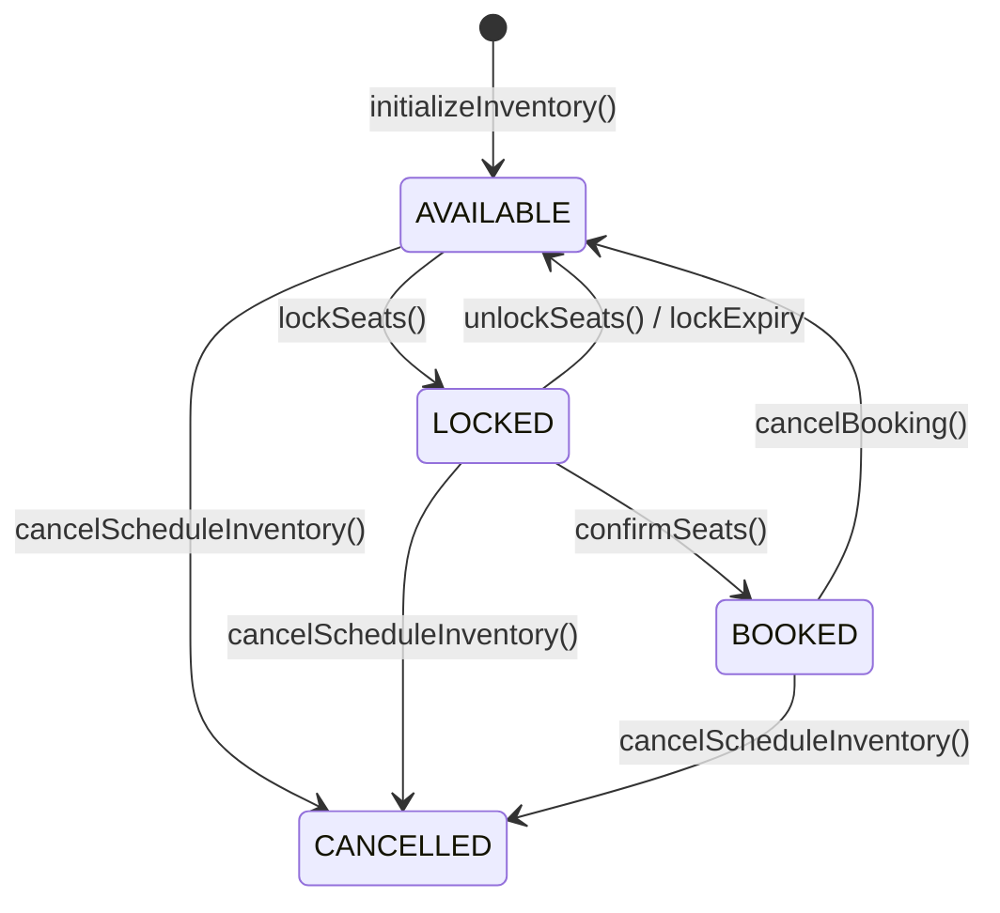
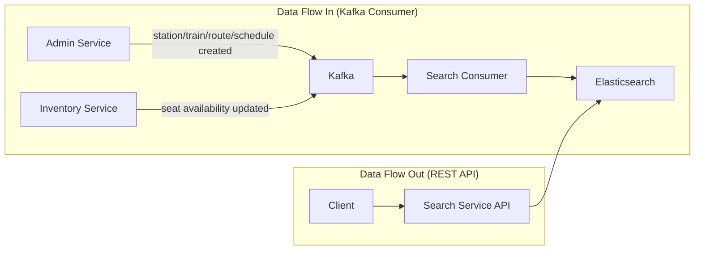
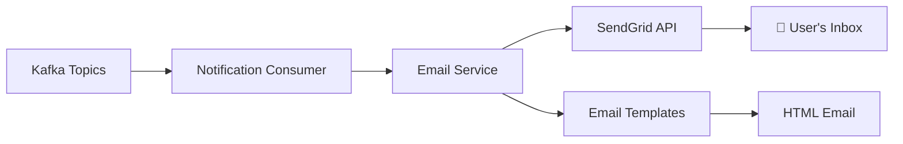
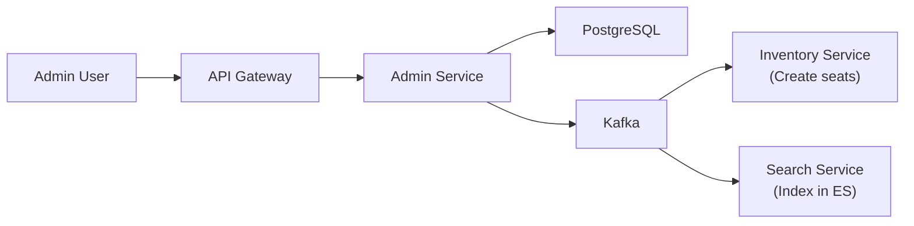
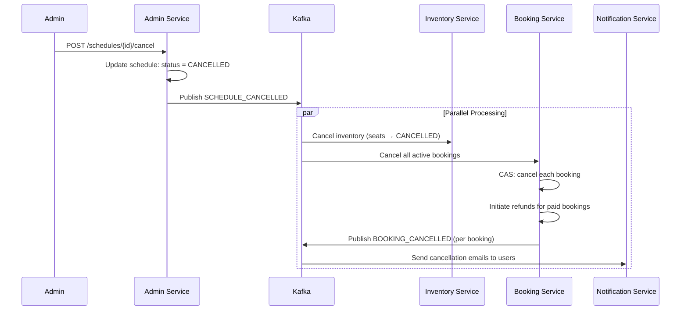

# 📦 Inventory, 🔍 Search, 📧 Notification & 🔧 Admin Services

> **Yeh chapter baaki 4 services cover karta hai — Inventory (seat management), Search (Elasticsearch), Notification (emails), aur Admin (CRUD).**

---

## Table of Contents

1. [Inventory Service](#-inventory-service)
2. [Search Service](#-search-service)
3. [Notification Service](#-notification-service)
4. [Admin Service](#-admin-service)
5. [Inter-Service Event Flow — Complete Picture](#inter-service-event-flow--complete-picture)
6. [Interview Questions — All Services](#interview-questions--all-services)

---

# 📦 Inventory Service

> **Inventory Service seats ka "source of truth" hai. Seat available hai, locked hai, ya booked hai — sab yaha decide hota hai.**

## What Does Inventory Service Do?

| Responsibility | Description |
|---|---|
| **Initialize Inventory** | Schedule create hone pe seats create karo |
| **Seat Availability** | Kitni seats available/locked/booked hain |
| **Lock Seats** | Temporarily hold seats (TTL-based) |
| **Unlock Seats** | Release held seats |
| **Confirm Seats** | Permanently assign seats to booking |
| **Cancel Booking** | Release permanently assigned seats |
| **Segment Booking** | Same seat, different journey segments |
| **Lock Expiry** | Background job to clean expired locks |

## Database Design

```prisma
model ScheduleInventory {
  id           String   @id @default(uuid())
  scheduleId   String   @unique
  trainId      String
  trainNumber  String
  trainName    String
  departureDate DateTime
  totalSeats   Int
  available    Int      // Counter: quickly shows available seats
  locked       Int      // Counter: seats being booked
  booked       Int      // Counter: confirmed seats
  status       String   @default("ACTIVE")
  version      Int      @default(0)
}

model SeatInventory {
  id           String   @id @default(uuid())
  scheduleId   String
  seatId       String
  seatNumber   Int
  seatType     String   // LOWER, MIDDLE, UPPER, SIDE_LOWER, SIDE_UPPER
  price        Float
  status       String   @default("AVAILABLE") // AVAILABLE, LOCKED, BOOKED, CANCELLED
  lockedBy     String?  // userId who locked
  lockedAt     DateTime?
  lockExpiresAt DateTime?
  bookingId    String?
  version      Int      @default(0)
}

model SeatSegmentLock {
  id           String   @id @default(uuid())
  scheduleId   String
  seatId       String
  fromSeq      Int      // Route sequence start
  toSeq        Int      // Route sequence end
  status       String   // LOCKED, BOOKED
  lockedBy     String
  bookingId    String?
  lockExpiresAt DateTime?
}

model RouteStop {
  id             String @id @default(uuid())
  scheduleId     String
  stationId      String
  stationName    String
  stationCode    String
  sequenceNumber Int
}
```

### Seat Status State Machine



## lockSeats — The Most Critical Function

### SQL Row-Level Locking

```sql
SELECT id, "seatId", "seatNumber", status, "lockedBy"
FROM seat_inventories
WHERE "scheduleId" = $1 AND "seatId" = ANY($2::text[])
FOR UPDATE NOWAIT
```

### 📚 `FOR UPDATE NOWAIT` Teaching

**Problem:**
```
Thread A: SELECT seat WHERE seatId = 'SEAT1' → status = AVAILABLE
Thread B: SELECT seat WHERE seatId = 'SEAT1' → status = AVAILABLE
Thread A: UPDATE seat SET status = 'LOCKED' → ✅
Thread B: UPDATE seat SET status = 'LOCKED' → ✅ (DOUBLE LOCK!)
```

**Solution: `FOR UPDATE NOWAIT`**
```
Thread A: SELECT ... FOR UPDATE NOWAIT → Acquires row lock on SEAT1
Thread B: SELECT ... FOR UPDATE NOWAIT → Row already locked → 
          IMMEDIATELY throws error (NOWAIT = don't wait)
Thread A: UPDATE status = LOCKED → ✅
Thread B: Catches error → Returns "Seats unavailable" to user
```

**`FOR UPDATE`** = Row-level lock. No other transaction can modify this row until current transaction commits/rollbacks.

**`NOWAIT`** = Don't wait for the lock. If already locked, throw error immediately. Without NOWAIT, Thread B would wait (potentially forever), creating bad user experience.

### Segment Overlap Detection

```sql
-- Check if any existing segment lock overlaps with requested segment
SELECT "seatId" FROM seat_segment_locks
WHERE "scheduleId" = $1
AND "seatId" = ANY($2::text[])
AND status IN ('LOCKED', 'BOOKED')
AND "fromSeq" < $toSeq    -- Overlap condition 1
AND "toSeq" > $fromSeq    -- Overlap condition 2
FOR UPDATE NOWAIT
```

**Overlap Condition Explained:**
```
Existing segment: Delhi(1) → Agra(2)
Requested segment: Agra(2) → Mumbai(4)

Overlap? fromSeq(1) < toSeq(4) ✅ AND toSeq(2) > fromSeq(2) ❌
NOT overlapping → Same seat can be booked! ✅

Existing segment: Delhi(1) → Jaipur(3)
Requested segment: Agra(2) → Mumbai(4)

Overlap? fromSeq(1) < toSeq(4) ✅ AND toSeq(3) > fromSeq(2) ✅
OVERLAPPING → Conflict! ❌
```

### recomputeSegmentSeatStatuses — Aggregate Refresh

```javascript
async function recomputeSegmentSeatStatuses(tx, scheduleId, seatIds) {
     for (const seatId of seatIds) {
          const locks = await tx.seatSegmentLock.findMany({
               where: { scheduleId, seatId, status: { in: ['LOCKED', 'BOOKED'] } },
          });

          let newStatus;
          if (locks.length === 0) newStatus = 'AVAILABLE';
          else if (locks.some(l => l.status === 'LOCKED')) newStatus = 'LOCKED';
          else newStatus = 'BOOKED';
          // Update SeatInventory.status to match
     }
}
```

**Why recompute instead of increment/decrement?**
- Increment/decrement can drift (bugs, crashes, partial updates)
- Recompute from source of truth = always correct
- **Interview answer**: "Counter drift is a common problem in distributed systems. Periodic recomputation from source data is a standard solution."

### recountScheduleAggregates — Source of Truth

```sql
SELECT
  COUNT(*) FILTER (WHERE status = 'AVAILABLE')::int AS available,
  COUNT(*) FILTER (WHERE status = 'LOCKED')::int AS locked,
  COUNT(*) FILTER (WHERE status = 'BOOKED')::int AS booked
FROM seat_inventories
WHERE "scheduleId" = $1
```

- Actual seat rows se count karo (source of truth)
- `ScheduleInventory.available/locked/booked` ko update karo
- **Prevents counter drift**: Even if a bug caused wrong increment, recount fixes it

### retryTransaction — Pessimistic Lock Retry

```javascript
async function retryTransaction(fn, maxRetries = 3) {
     for (let attempt = 1; attempt <= maxRetries; attempt++) {
          try {
               return await fn();
          } catch (error) {
               // Retry only on serialization failures or lock conflicts
               if (isRetryableError(error) && attempt < maxRetries) {
                    const delay = 100 * Math.pow(2, attempt - 1);
                    await new Promise(r => setTimeout(r, delay));
                    continue;
               }
               throw error;
          }
     }
}
```

**When does `FOR UPDATE NOWAIT` fail?**
- Two users booking same seat at exact same time
- One gets the lock, other gets `LOCK_NOT_AVAILABLE` error
- `retryTransaction` retries with backoff — maybe the first user's transaction finished

### Availability Publish After Every Change

```javascript
// After every lock/unlock/confirm/cancel:
await inventoryProducer.publishSeatAvailabilityUpdated(
     scheduleId, trainId, available, locked, booked
);
```

- Search Service subscribes to this topic
- Updates Elasticsearch document with latest seat counts
- **Eventually consistent**: Search results may be slightly stale (seconds)

---

# 🔍 Search Service

> **Search Service Elasticsearch-powered hai. Train search, station autocomplete — sab yaha hota hai.**

## Architecture



**Key insight**: Search Service has NO database. It only uses Elasticsearch. All data comes from Kafka events.

## Elasticsearch Index Design

### Train Index (`trains`)
```json
{
  "trainId": "uuid",
  "trainNumber": "12345",
  "trainName": "Rajdhani Express",
  "route": [
    {
      "stationId": "uuid",
      "stationName": "New Delhi",
      "stationCode": "NDLS",
      "sequenceNumber": 1,
      "arrivalTime": null,
      "departureTime": "16:00",
      "distanceFromOrigin": 0
    },
    {
      "stationId": "uuid",
      "stationName": "Mumbai Central",
      "stationCode": "MMCT",
      "sequenceNumber": 5,
      "arrivalTime": "08:00",
      "departureTime": null,
      "distanceFromOrigin": 1384
    }
  ],
  "schedules": [
    {
      "scheduleId": "uuid",
      "departureDate": "2026-07-01",
      "status": "ACTIVE",
      "available": 42,
      "locked": 3,
      "booked": 15
    }
  ],
  "seatSummary": { "total": 60, "LOWER": 20, "UPPER": 20, "MIDDLE": 20 }
}
```

### Station Index (`stations`)
```json
{
  "stationId": "uuid",
  "name": "New Delhi",
  "code": "NDLS",
  "city": "Delhi",
  "suggest": {
    "input": ["New Delhi", "NDLS", "Delhi"],
    "weight": 10
  }
}
```

**`suggest` field**: Elasticsearch **Completion Suggester** ke liye. Fast autocomplete + fuzzy matching support karta hai.

## searchTrains — Three-Step Resolution

### Step 1: resolveStation — Fuzzy Station Matching

```javascript
const resolveStation = async (input) => {
     // Strategy 1: Exact code match
     // "NDLS" → Direct match
     const exactResult = await esClient.search({
          index: STATION_INDEX,
          query: { term: { code: input.toUpperCase() } },
     });
     if (exactResult.hits.hits.length > 0) return result;

     // Strategy 2: Completion Suggester (handles typos)
     // "dehli" → "Delhi" (fuzzy match)
     const suggestResult = await esClient.search({
          index: STATION_INDEX,
          suggest: {
               station_suggest: {
                    prefix: input,
                    completion: { field: 'suggest', fuzzy: { fuzziness: 'AUTO' } },
               },
          },
     });

     // Strategy 3: Fuzzy multi-match
     // "new del" → matches "New Delhi" name field
     const fuzzyResult = await esClient.search({
          index: STATION_INDEX,
          query: {
               multi_match: {
                    query: input,
                    fields: ['name', 'city'],
                    fuzziness: 'AUTO',
                    prefix_length: 1,
               },
          },
     });
};
```

**`fuzziness: 'AUTO'`**: 
- 1-2 character words → Exact match
- 3-5 character words → 1 edit distance allowed
- 6+ character words → 2 edit distances allowed
- "dehli" (5 chars) → 1 edit → "Delhi" ✅

### Step 2: Nested Query for Route Matching

```javascript
const query = {
     bool: {
          must: [
               {
                    nested: {
                         path: 'route',
                         query: { term: { 'route.stationId': fromStation.stationId } },
                         inner_hits: { name: 'from_station' },
                    },
               },
               {
                    nested: {
                         path: 'route',
                         query: { term: { 'route.stationId': toStation.stationId } },
                         inner_hits: { name: 'to_station' },
                    },
               },
          ],
     },
};
```

**Nested Query** kyu?
- `route` field ek array of objects hai
- Without `nested`, Elasticsearch independently match karega fields
- E.g., train A has route [Delhi, Mumbai] and train B has route [Agra, Jaipur]
- Without nested: query "Delhi to Jaipur" might match because "Delhi" exists in A and "Jaipur" exists in B
- With nested: Each route stop is treated as independent unit

**`inner_hits`**: Query match hone ke baad, exactly KAUN SA route stop match hua woh return karo (departure time, arrival time, sequence number needed)

### Step 3: Sequence Validation

```javascript
if (fromHit.sequenceNumber >= toHit.sequenceNumber) {
     return null; // Invalid: "Mumbai to Delhi" on a Delhi→Mumbai train
}
```

**Why?** Train Delhi → Agra → Mumbai jaati hai. Agar user "Mumbai to Delhi" search kare toh sequence 5 → 1 hai → invalid direction. Filter out.

## autocompleteStation

```javascript
const autocompleteStation = async (prefix) => {
     const result = await esClient.search({
          index: STATION_INDEX,
          suggest: {
               station_suggest: {
                    prefix,                    // What user typed so far
                    completion: {
                         field: 'suggest',     // Completion suggester field
                         fuzzy: { fuzziness: 'AUTO' }, // Typo tolerance
                         size: 10,             // Max 10 suggestions
                    },
               },
          },
     });
};
```

**Frontend Integration:**
```
User types: "De"
API returns: ["Delhi", "Dehradun", "Dewas"]

User types: "Del"
API returns: ["Delhi", "Delohi Junction"]

User types: "Dehli" (typo!)
API returns: ["Delhi"] ← Fuzzy matching fixes it!
```

## Painless Scripts for Elasticsearch Updates

```javascript
// Adding a schedule to an existing train document
await esClient.update({
     index: TRAIN_INDEX,
     id: trainId,
     script: {
          source: `
               if (ctx._source.schedules == null) { ctx._source.schedules = []; }
               // Remove existing schedule with same id (idempotent)
               ctx._source.schedules.removeIf(s -> s.scheduleId == params.scheduleId);
               ctx._source.schedules.add(params.newSchedule);
          `,
          params: { scheduleId, newSchedule: { ... } },
     },
     refresh: true, // Make changes immediately searchable
});
```

**Painless** = Elasticsearch ki scripting language. JSON me embedded script jo server-side execute hota hai.

**`refresh: true`** = Normally Elasticsearch 1 second baad search results update karta hai. `refresh: true` immediately update karta hai. Development me useful, production me performance impact hai.

---

# 📧 Notification Service

> **Notification Service pure consumer hai — koi REST API nahi hai. Kafka se events sunti hai aur emails bhejti hai.**

## Architecture



## Email Service — SendGrid with Retry

```javascript
class EmailService {
     constructor() {
          this.from = config.MAIL_SEND;  // Sender email from config
          this.maxRetries = 3;
     }

     async sendWithRetry(msg, retries = 0) {
          try {
               await sgMail.send(msg);    // SendGrid SDK
               return { success: true };
          } catch (error) {
               if (retries < this.maxRetries - 1) {
                    const delay = Math.pow(2, retries) * 1000;
                    // 1s, 2s, 4s — exponential backoff
                    await new Promise(resolve => setTimeout(resolve, delay));
                    return this.sendWithRetry(msg, retries + 1);
               }
               throw error; // DLQ handler will catch this
          }
     }
}
```

**Key Design**: Retry with exponential backoff. If still fails after 3 attempts → DLQ handler catches it → message goes to `dlq.notification-service` topic.

## Email Types

| Kafka Topic | Email Template | When? |
|---|---|---|
| `notification.otp-email` | OTP code with timer | User registration |
| `notification.welcome-email` | Welcome message | OTP verified, user created |
| `booking.confirmed` | Ticket details, seat numbers | Payment success |
| `booking.failed` | Failure reason, retry link | Payment/booking failed |
| `booking.cancelled` | Refund details | User/system cancelled |

## Consumer — Topic Router

```javascript
await consumer.run({
     eachMessage: withDLQ(producer, KAFKA_TOPICS.DLQ_NOTIFICATION, logger,
          async ({ topic, parsedValue }) => {
               switch (topic) {
                    case KAFKA_TOPICS.OTP_EMAIL:
                         await emailService.sendOtpEmail(
                              parsedValue.email, parsedValue.otp, parsedValue.ttlMinutes
                         );
                         break;
                    case KAFKA_TOPICS.BOOKING_CONFIRMED:
                         if (parsedValue.email) {
                              await emailService.sendBookingConfirmedEmail(
                                   parsedValue.email, parsedValue
                              );
                         }
                         break;
                    // ... other topics
               }
          }
     ),
});
```

**`if (parsedValue.email)`**: Booking events me email optional hai (user lookup fail ho sakta hai). Agar email nahi hai toh silently skip karo — email bhejne ke liye email address zaroori hai.

---

# 🔧 Admin Service

> **Admin Service CRUD operations provide karta hai — Train, Station, Route, Schedule create/update/delete.**

## Architecture



## Service Files

| File | Responsibility |
|---|---|
| `train.service.js` | Create/update trains + publish events |
| `station.service.js` | Create/update stations + publish events |
| `schedule.service.js` | Create/cancel schedules + publish events |

## Key Flow: Schedule Created

```javascript
const createSchedule = async (trainId, departureDate) => {
     // 1. Validate train exists
     const train = await prisma.train.findUnique({
          where: { id: trainId },
          include: { seats: true, route: { include: { routeStations: { include: { station: true } } } } },
     });

     // 2. Create schedule in DB
     const schedule = await prisma.schedule.create({
          data: { trainId, departureDate: new Date(departureDate), status: 'ACTIVE' },
     });

     // 3. Publish SCHEDULE_CREATED event with ALL data
     await adminProducer.publishScheduleCreated({
          scheduleId: schedule.id,
          trainId: train.id,
          trainNumber: train.trainNumber,
          trainName: train.trainName,
          departureDate: schedule.departureDate,
          seats: train.seats.map(s => ({
               seatId: s.id,
               seatNumber: s.seatNumber,
               seatType: s.seatType,
               price: s.price,
          })),
          route: train.route.routeStations.map(rs => ({
               stationId: rs.station.id,
               stationName: rs.station.name,
               stationCode: rs.station.code,
               sequenceNumber: rs.sequenceNumber,
          })),
     });
};
```

**Why send ALL data in the event?**

**Event Enrichment Pattern**: Event me sirf IDs bhejne ki jagah, poora data bhejte hain. Benefits:
1. Inventory Service ko train details ke liye Admin Service API call nahi karna padta
2. Less coupling — consumer need not know producer's API
3. Event alone me enough information hai to create inventory + index in ES

### Cancel Schedule Flow



---

# Inter-Service Event Flow — Complete Picture

```mermaid
graph TB
    subgraph "Admin Actions"
        A1["Create Station"] -->|"station.created"| K
        A2["Create Train + Route"] -->|"route.created"| K
        A3["Create Schedule"] -->|"schedule.created"| K
        A4["Cancel Schedule"] -->|"schedule.cancelled"| K
    end

    K["Apache Kafka"]

    subgraph "Consumer: Inventory Service"
        K -->|"schedule.created"| I1["Initialize Seats"]
        K -->|"schedule.cancelled"| I2["Cancel All Seats"]
        I1 -->|"seat.availability.updated"| K
        I2 -->|"seat.availability.updated"| K
    end

    subgraph "Consumer: Search Service"
        K -->|"station.created"| S1["Index Station"]
        K -->|"route.created"| S2["Index Train + Route"]
        K -->|"schedule.created"| S3["Add Schedule to Train"]
        K -->|"schedule.cancelled"| S4["Update Schedule Status"]
        K -->|"seat.availability.updated"| S5["Update Availability Counts"]
    end

    subgraph "Consumer: Booking Service"
        K -->|"payment.success"| B1["Confirm Booking"]
        K -->|"payment.failed"| B2["Fail Booking"]
        K -->|"schedule.cancelled"| B3["Cancel Active Bookings"]
        B1 -->|"booking.confirmed"| K
        B2 -->|"booking.failed"| K
        B3 -->|"booking.cancelled"| K
    end

    subgraph "Consumer: Notification Service"
        K -->|"otp.email"| N1["Send OTP"]
        K -->|"welcome.email"| N2["Send Welcome"]
        K -->|"booking.confirmed"| N3["Send Confirmation"]
        K -->|"booking.failed"| N4["Send Failure"]
        K -->|"booking.cancelled"| N5["Send Cancellation"]
    end

    style K fill:#FF9800,color:#fff
```



---

# Interview Questions — All Services

### Inventory Service

**Q: `FOR UPDATE NOWAIT` kyu use kiya `FOR UPDATE` ki jagah?**
A: "`FOR UPDATE` wait karta hai lock milne tak — user ka request hang karega (bad UX). `NOWAIT` immediately error throw karta hai — we catch it, retry with backoff ya user ko 'try again' bolta hai. Better user experience."

**Q: Counter drift kya hota hai aur kaise fix kiya?**
A: "Jab available/locked/booked counters increment/decrement se update hote hain, crashes ya bugs se drift ho sakta hai (e.g., decrement hua par increment nahi). Fix: Periodically `recount` karo actual seat rows se — yeh source of truth hai."

**Q: Segment booking me overlap kaise detect karte ho?**
A: "Mathematical overlap condition: `a.fromSeq < b.toSeq AND a.toSeq > b.fromSeq`. Dono conditions true → segments overlap. SQL me `WHERE fromSeq < $toSeq AND toSeq > $fromSeq` check karte hain."

### Search Service

**Q: Elasticsearch kyu use kiya PostgreSQL ki jagah?**
A: "PostgreSQL me `LIKE '%mumbai%'` karne pe full table scan hota hai — slow for large datasets. Elasticsearch inverted index use karta hai — O(1) lookup. Plus: fuzzy search (typo handling), completion suggestor (autocomplete), nested queries."

**Q: Search data stale ho sakta hai — kaise handle karte ho?**
A: "Eventually consistent design. Kafka events se Elasticsearch update hota hai (seconds of delay). Booking flow me actual availability Inventory Service se real-time check hota hai (HTTP call). Search sirf 'approximate' results dikhata hai."

**Q: Nested query kya hai aur kab use karte hain?**
A: "Elasticsearch me array of objects independently index hota hai. Without nested, cross-object matching ho sakta hai (wrong results). Nested type har object ko separate Lucene document banata hai — accurate filtering."

### Notification Service

**Q: Notification Service me database kyu nahi hai?**
A: "Stateless design. Email bhejni hai → bhej do. Koi state maintain nahi karna hai. Agar email fail ho toh Kafka retry + DLQ handle kar leta hai. Database ki complexity unnecessary hai."

**Q: SendGrid fail hone pe kya hota hai?**
A: "3 attempts with exponential backoff (1s, 2s, 4s). Phir bhi fail → DLQ me message jaata hai → Manual investigation. User ko pata nahi chalta because booking already confirmed hai — email just notification hai."

### Admin Service

**Q: Event enrichment kya hai aur kyu use kiya?**
A: "Events me sirf IDs bhejne ki jagah, poora data bhejte hain. Benefits: (1) Consumer ko extra API calls nahi karne padte (2) Less coupling (3) Event self-contained hai — debugging easy. Drawback: Event payload larger hota hai."

---

> **Next Chapter**: [05 — Design Patterns & Interview Mastery](./05_design_patterns_and_interviews.md)
