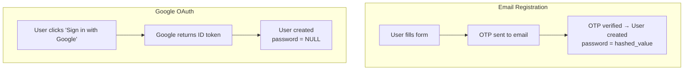
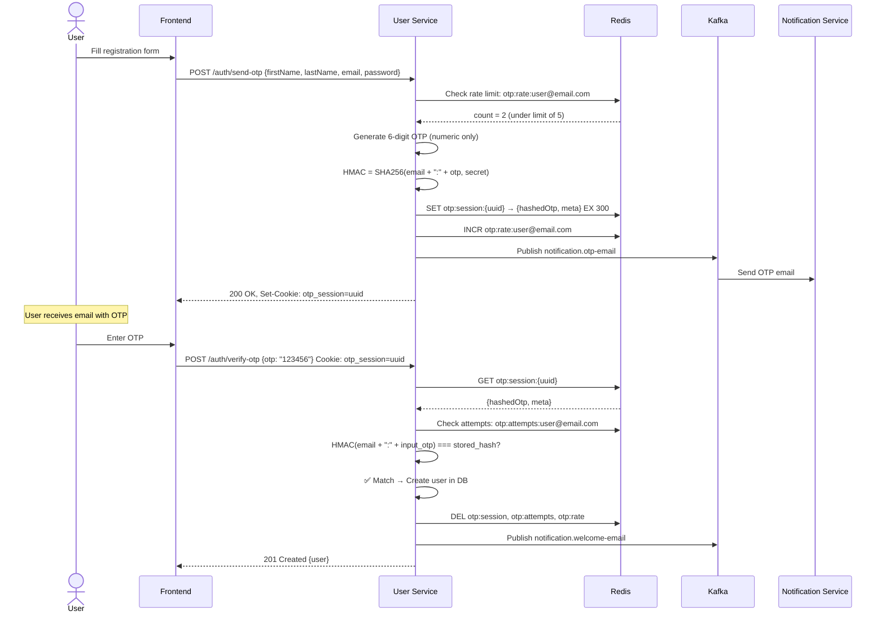
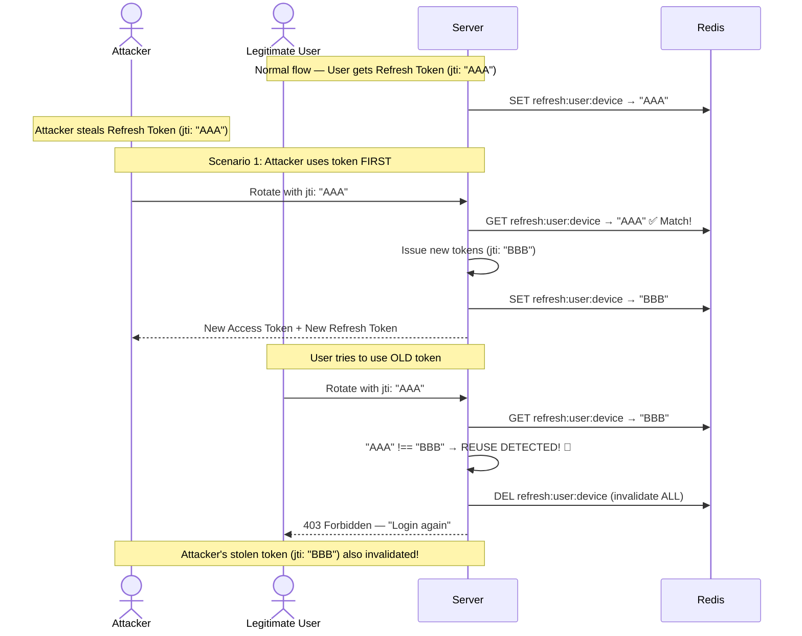
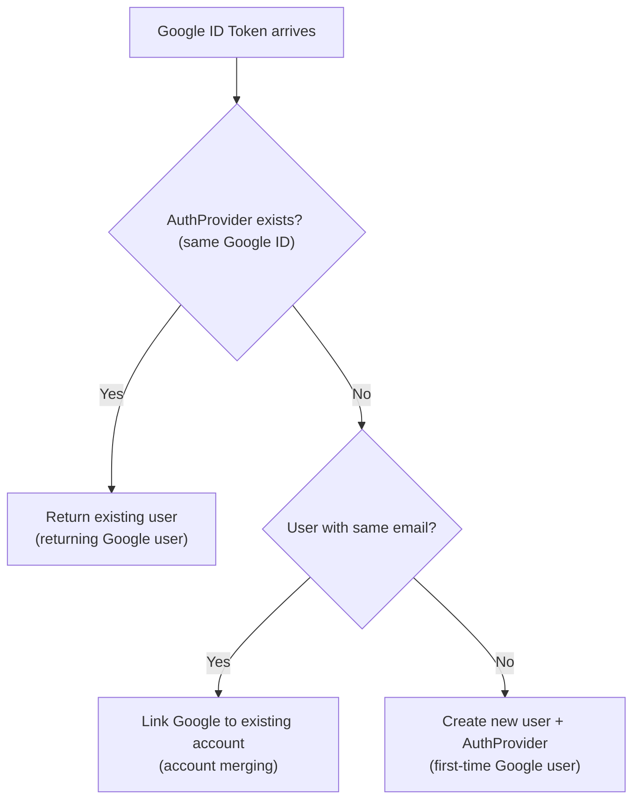
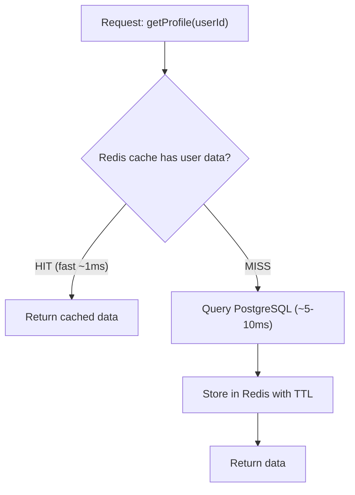
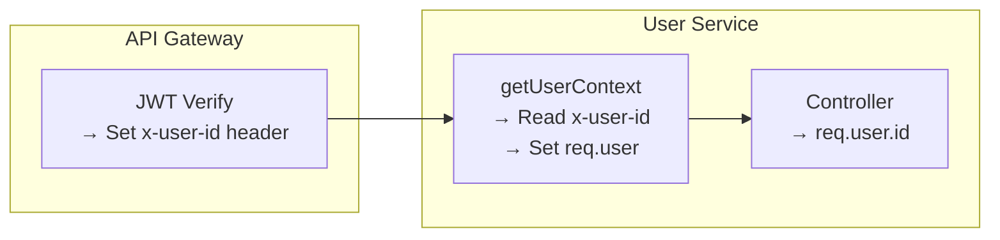
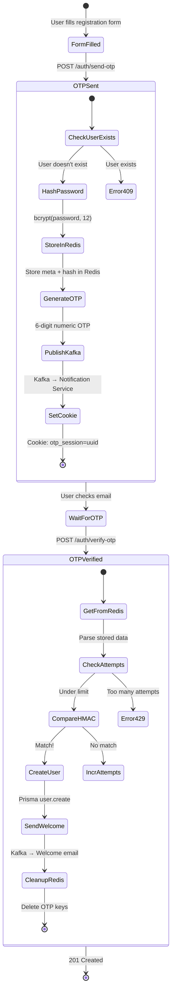
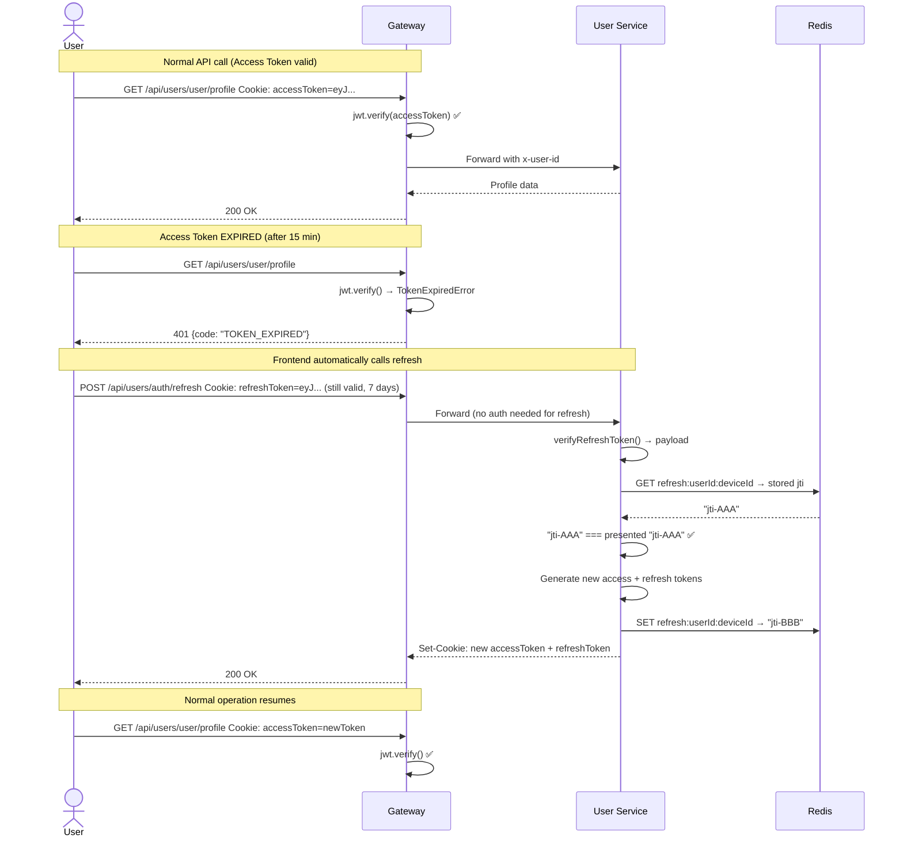

# 👤 User Service — Complete Deep Dive

> **User Service authentication ka malik hai. OTP-based registration, JWT tokens with rotation, Google OAuth — sab yaha hota hai.**

---

## Table of Contents

1. [User Service Kya Karta Hai?](#user-service-kya-karta-hai)
2. [Prisma Schema — User + AuthProvider](#prisma-schema--user--authprovider)
3. [utils/otp.js — OTP Generation + Verification](#utilsotpjs--otp-generation--verification)
4. [utils/auth.js — JWT Token Generation](#utilsauthjs--jwt-token-generation)
5. [utils/deviceFingerPrint.js — Device Identification](#utilsdevicefingerprintjs--device-identification)
6. [services/auth.service.js — Core Auth Logic](#servicesauthservicejs--core-auth-logic)
7. [services/user.service.js — Profile with Cache](#servicesuser.servicejs--profile-with-cache)
8. [controllers/auth.controller.js — Cookie Management](#controllersauthcontrollerjs--cookie-management)
9. [middlewares/getUserContext.js — Gateway Integration](#middlewaresgetusercontextjs--gateway-integration)
10. [Complete Auth Flows (Diagrams)](#complete-auth-flows)
11. [Interview Questions — User Service](#interview-questions--user-service)

---

## User Service Kya Karta Hai?

| Responsibility | Description |
|---|---|
| **OTP Registration** | Email + OTP se user register karo |
| **Login** | Email + Password se authenticate karo |
| **JWT Token Management** | Access + Refresh token generate karo |
| **Token Rotation** | Expired access token ko refresh karo |
| **Google OAuth** | Google se one-click login |
| **Profile Cache** | User profile Redis me cache karo |
| **Device Tracking** | Per-device refresh token manage karo |
| **Notification Events** | OTP aur Welcome emails Kafka se bhejo |

---

## Prisma Schema — User + AuthProvider

```prisma
model User {
  id            String   @id @default(uuid())
  firstName     String
  lastName      String
  email         String   @unique
  password      String?          // Nullable! Google OAuth users have no password
  emailVerified Boolean  @default(false)
  createdAt     DateTime @default(now())
  updatedAt     DateTime @updatedAt
  AuthProviders AuthProvider[]
}

model AuthProvider {
  id         String @id @default(uuid())
  provider   String              // "google", "github", etc.
  providerId String              // Google's unique user ID (payload.sub)
  userId     String

  user User @relation(fields: [userId], references: [id], onDelete: Cascade)

  @@unique([provider, providerId])  // One Google account → one record
  @@unique([userId, provider])      // One user → one Google link
  @@index([userId])
}
```

### Why `password` is Nullable?



Google se aane wale users ka password nahi hota. Isliye `String?` (nullable) rakha hai.

**Login pe check:**
```javascript
if (!existingUser.password) {
     throw new BadRequestError(
          "This account was created with Google. Please sign in with Google.",
          "OAUTH_ONLY_ACCOUNT"
     );
}
```

### Compound Unique Constraints

```prisma
@@unique([provider, providerId])  // Ensure one Google account maps to one AuthProvider record
@@unique([userId, provider])      // Ensure one user has only one Google link
```

**Why two `@@unique`?**
1. `[provider, providerId]` — Same Google account se multiple AuthProvider records nahi bane
2. `[userId, provider]` — Ek user ke paas ek hi Google link ho (duplicate link prevention)

**`onDelete: Cascade`** — Agar User delete ho toh uske AuthProvider records bhi automatically delete ho jayenge.

---

## utils/otp.js — OTP Generation + Verification

### 📚 OTP System Complete Teaching

**OTP (One-Time Password) Flow:**



### Redis Keys Used

| Key Pattern | Purpose | TTL |
|---|---|---|
| `otp:session:{uuid}` | OTP data + user metadata | 300s (5 min) |
| `otp:rate:{email}` | Rate limit counter | 3600s (1 hour) |
| `otp:attempts:{email}` | Verification attempt counter | 300s (5 min) |

### OTP Generation

```javascript
const otpGenerator = require('otp-generator');

const otp = otpGenerator.generate(6, {
     upperCaseAlphabets: false,
     lowerCaseAlphabets: false,
     specialChars: false
});
// Output: "847291" (6-digit numeric only)
```

### HMAC-based OTP Storage (Not Plain Text!)

```javascript
const HMAC_SECRET = config.OTP_HMAC_SECRET;

function hmacFor(email, otp) {
     return crypto.createHmac('sha256', HMAC_SECRET)
                  .update(email + ":" + otp)
                  .digest('hex');
}
```

**Why HMAC and not plain text?**

```
❌ Plain text storage:
Redis: otp:session:abc → { otp: "847291", email: "user@gmail.com" }
If Redis compromised → Attacker sees OTP → Account takeover!

✅ HMAC storage:
Redis: otp:session:abc → { hashedOtp: "a3f2b8c1...", email: "user@gmail.com" }
If Redis compromised → Attacker sees hash → Cannot reverse to get OTP
Only someone who knows HMAC_SECRET + email + otp can generate same hash
```

**Why email in HMAC input?**
```
Without email: HMAC = SHA256(otp)
Attacker knows OTP format (6 digits) → only 10^6 = 1,000,000 possibilities
Can precompute rainbow table of ALL possible OTPs

With email: HMAC = SHA256(email + ":" + otp)
Must know EXACT email for each OTP → rainbow table useless
Different email = different hash even for same OTP
```

### Rate Limiting (Per-Email)

```javascript
const RATE_MAX = 5; // Max 5 OTPs per hour

async function generateAndStoreOtp(meta) {
     const rateKey = `otp:rate:${meta.email}`;
     const sentCount = parseInt(await redis.get(rateKey) || '0', 10);
     
     if (sentCount >= RATE_MAX) {
          throw new TooManyRequestsError("Too many OTP requests. Try again later.");
     }

     // ... generate OTP ...

     await redis.incr(rateKey);       // Increment counter
     await redis.expire(rateKey, 3600); // Reset after 1 hour
}
```

**Why rate limit OTPs?**
1. **Cost**: Each OTP = 1 email via SendGrid (costs money at scale)
2. **Spam**: Attacker can flood someone's inbox with OTPs
3. **Brute force**: More OTPs generated = more chances to intercept one

### Verification with Attempt Limiting

```javascript
async function verifyOtp(otp, otpSessionId) {
     const rawData = await redis.get(`otp:session:${otpSessionId}`);
     if (!rawData) return null;  // Expired or invalid session

     const { hashedOtp: storedOtp, meta } = JSON.parse(rawData);

     // Check verification attempts
     const attemptsKey = `otp:attempts:${meta.email}`;
     const attemptsCount = parseInt(await redis.get(attemptsKey) || '0', 10);
     if (attemptsCount >= ATTEMPT_MAX) {
          throw new TooManyRequestsError("Too many attempts to verify OTP");
     }

     // Timing-safe comparison
     const hashedOtp = hmacFor(meta.email, otp);
     if (crypto.timingSafeEqual(
          Buffer.from(hashedOtp, 'hex'),
          Buffer.from(storedOtp, 'hex')
     )) {
          // SUCCESS: Clean up all OTP-related keys
          await redis.del(`otp:session:${otpSessionId}`, attemptsKey);
          await redis.del(`otp:rate:${meta.email}`);
          return meta;  // Return stored user metadata
     } else {
          // FAILURE: Increment attempt counter
          await redis.incr(attemptsKey);
          await redis.expire(attemptsKey, OTP_TTL);
          return null;
     }
}
```

**Three Security Layers:**
1. **Rate limit** — Max 5 OTPs per hour per email
2. **Attempt limit** — Max 5 wrong guesses per OTP session
3. **TTL** — OTP expires after 5 minutes

**`crypto.timingSafeEqual` again!** Even for OTP verification — timing attack prevention.

**Cleanup on success**: All three keys (`session`, `attempts`, `rate`) delete karo. Clean state.

---

## utils/auth.js — JWT Token Generation

```javascript
exports.generateAccessToken = (userId) => {
     const payload = { id: userId };
     return jwt.sign(payload, config.JWT_ACCESS_SECRET, { expiresIn: config.ACCESS_TOKEN_EXP });
};
// Returns: eyJhbGci... (15 minute token)

exports.generateRefreshToken = (userId) => {
     const payload = {
          id: userId,
          jti: crypto.randomUUID()  // Unique token identifier
     };
     return jwt.sign(payload, config.JWT_REFRESH_SECRET, { expiresIn: config.REFRESH_TOKEN_EXP });
};
// Returns: eyJhbGci... (7 day token with unique jti)
```

### 📚 Access Token vs Refresh Token

| Property | Access Token | Refresh Token |
|---|---|---|
| **Purpose** | API authentication | Get new access token |
| **Lifetime** | 15 minutes | 7 days |
| **Secret** | `JWT_ACCESS_SECRET` | `JWT_REFRESH_SECRET` (different!) |
| **Payload** | `{ id }` | `{ id, jti }` |
| **Storage** | httpOnly cookie | httpOnly cookie |
| **Where checked** | API Gateway | User Service |

**Why two tokens?**
```
Only Access Token (long-lived):
  If stolen → Attacker has access for days → BAD

Only Access Token (short-lived):
  Expires every 15 min → User must login every 15 min → BAD UX

Access + Refresh Token:
  Access stolen → Only works for 15 min → Limited damage
  Refresh stolen → Detected by rotation → Old tokens invalidated
  BEST OF BOTH WORLDS
```

### JTI (JWT ID) — Token Rotation Detection

```javascript
jti: crypto.randomUUID()  // e.g., "a1b2c3d4-e5f6-7890-abcd-ef1234567890"
```

**`jti` = JSON Token Identifier** — Every refresh token gets a unique random ID.

**Why?** Token reuse detection (explained in `rotateRefreshToken` section below).

---

## utils/deviceFingerPrint.js — Device Identification

```javascript
function getDeviceFingerprint(req) {
     const userAgent = req.headers["user-agent"] || "";
     const ip = req.ip || "";
     const accept = req.headers["accept"] || "";

     const raw = `${userAgent}|${ip}|${accept}`;

     return crypto.createHash("sha256")
          .update(raw)
          .digest("hex")
          .slice(0, 16); // Short 16-char device ID
}
```

### Purpose

**Per-device session management:**
```
Redis Key: refresh:userId:deviceId → jti

User A on Chrome Desktop:  refresh:user123:a1b2c3d4e5f6g7h8 → "jti-chrome"
User A on Mobile Safari:   refresh:user123:z9y8x7w6v5u4t3s2 → "jti-safari"
```

**Benefits:**
1. User can be logged in on multiple devices simultaneously
2. Logging out of one device doesn't affect other devices
3. Token reuse detection is per-device (not global)

**How fingerprint is generated:**
```
User-Agent: "Mozilla/5.0 (Windows NT 10.0; Win64; x64) Chrome/120..."
IP: "192.168.1.100"
Accept: "text/html,application/json"
Combined: "Mozilla/5.0...|192.168.1.100|text/html,..."
SHA256 hash → first 16 chars = deviceId
```

**Limitation**: IP changes (mobile networks, VPNs) will create new deviceIds → extra refresh tokens in Redis. Not a security issue, just slight Redis waste.

---

## services/auth.service.js — Core Auth Logic

### sendOTP — Registration Step 1

```javascript
const sendOTP = async (firstName, lastName, email, password) => {
     // 1. Check if user already exists
     const existingUser = await prisma.user.findUnique({ where: { email } });
     if (existingUser) {
          throw new ConflictError("user already exists");
     }

     // 2. Hash password NOW (before storing in Redis)
     const hashedPassword = await bcrypt.hash(password, 12);

     // 3. Store metadata + OTP in Redis
     const meta = { firstName, lastName, email, hashedPassword };
     const { otp, otpSessionId } = await generateAndStoreOtp(meta);

     // 4. Send OTP email via Kafka → Notification Service
     await notificationProducer.sendOtpEmail(email, otp, (config.OTP_TTL) / 60);

     return { otpSessionId };
};
```

**Why hash password before storing in Redis?**
```
❌ Store plain password in Redis meta:
  Redis compromised → Attacker gets plain passwords → Catastrophic

✅ Hash before storing:
  Redis compromised → Attacker gets bcrypt hash → Useless
  (bcrypt is intentionally slow to brute force)
```

**`bcrypt.hash(password, 12)`** — 12 = salt rounds. Higher = slower hash = harder to brute force. 12 is standard recommendation (takes ~250ms per hash).

### verifyOTP — Registration Step 2

```javascript
const verifyOTP = async (otp, otpSessionId) => {
     const meta = await verifyOtp(otp, otpSessionId);
     if (meta === null) {
          throw new BadRequestError("Invalid or expired OTP", "OTP_INVALID");
     }

     // Create user in database
     const user = await prisma.user.create({
          data: {
               firstName: meta.firstName,
               lastName: meta.lastName,
               email: meta.email,
               password: meta.hashedPassword,
               emailVerified: true    // OTP verified → email is verified
          }
     });

     // Send welcome email
     await notificationProducer.sendWelcomeEmail(meta.email, meta.firstName);
     return user;
};
```

**Why `emailVerified: true`?** OTP sirf email pe jaata hai. Agar user ne OTP correctly enter kiya, toh it proves they own that email address. No need for separate email verification link.

### login — Password Verification + Token Issue

```javascript
const login = async (email, password, deviceId) => {
     // 1. Find user
     const existingUser = await prisma.user.findUnique({ where: { email } });
     if (!existingUser) {
          throw new UnauthorizedError("Invalid email or password", "INVALID_CREDENTIALS");
     }

     // 2. Check if Google-only account
     if (!existingUser.password) {
          throw new BadRequestError(
               "This account was created with Google. Please sign in with Google.",
               "OAUTH_ONLY_ACCOUNT"
          );
     }

     // 3. Verify password
     const doesPasswordMatch = await bcrypt.compare(password, existingUser.password);
     if (!doesPasswordMatch) {
          throw new UnauthorizedError("Invalid email or password", "INVALID_CREDENTIALS");
     }

     // 4. Generate tokens
     const accessToken = generateAccessToken(existingUser.id);
     const refreshToken = generateRefreshToken(existingUser.id);

     // 5. Store refresh token's JTI in Redis (per device)
     const { jti } = jwt.decode(refreshToken);
     await redis.set(`refresh:${existingUser.id}:${deviceId}`, jti, 'EX', config.REFRESH_TOKEN_EXP_SEC);

     // 6. Cache user profile in Redis
     const { password: _password, ...safeUser } = existingUser;
     await redis.set(`user:${existingUser.id}`, JSON.stringify(safeUser), 'EX', config.REDIS_USER_TTL);

     return { accessToken, refreshToken, loggedInUser: safeUser };
};
```

**Security Practice: Same Error for Wrong Email AND Wrong Password**

```javascript
// ✅ Good: Same message for both
throw new UnauthorizedError("Invalid email or password");

// ❌ Bad: Different messages
throw new UnauthorizedError("User not found");     // Tells attacker email doesn't exist
throw new UnauthorizedError("Wrong password");      // Tells attacker email EXISTS
```
Attacker can use different messages to enumerate valid email addresses.

**`{ password: _password, ...safeUser }`** — Destructuring trick:
```javascript
const user = { id: "1", email: "a@b.com", password: "$2b$12$hash..." };
const { password: _password, ...safeUser } = user;
// safeUser = { id: "1", email: "a@b.com" }  ← No password!
// _password = "$2b$12$hash..."  ← Captured but not used
```

### rotateRefreshToken — Token Rotation with Reuse Detection

```javascript
const rotateRefreshToken = async (refreshToken, deviceId) => {
     // 1. Verify refresh token (check signature + expiry)
     const payload = verifyRefreshToken(refreshToken);
     const { id: userId, jti } = payload;

     // 2. Get stored JTI from Redis
     const storedJti = await redis.get(`refresh:${userId}:${deviceId}`);

     // 3. No stored JTI → Session expired
     if (!storedJti) {
          throw new ForbiddenError("Session Expired", "Login AGAIN");
     }

     // 4. JTI mismatch → TOKEN REUSE DETECTED!
     if (storedJti !== jti) {
          await redis.del(`refresh:${userId}:${deviceId}`);  // Invalidate session
          throw new ForbiddenError("Refresh token reused", "LOGIN AGAIN");
     }

     // 5. Issue new token pair
     const newAccessToken = generateAccessToken(payload.id);
     const newRefreshToken = generateRefreshToken(payload.id);
     const { jti: newJti } = jwt.decode(newRefreshToken);

     // 6. Store NEW JTI (old JTI is now invalid)
     await redis.set(`refresh:${payload.id}:${deviceId}`, newJti, 'EX', config.REFRESH_TOKEN_EXP_SEC);

     return { newAccessToken, newRefreshToken };
};
```

### 📚 Token Rotation + Reuse Detection — Complete Teaching

**Problem: Refresh Token Theft**



**How it works:**
1. Every refresh token has a unique `jti`
2. Redis stores the LATEST valid `jti` per device
3. When rotating: `stored_jti === presented_jti`?
   - ✅ Match → Issue new tokens, store new jti
   - ❌ Mismatch → Someone used an old token → **REUSE** → Kill session

**Result**: Even if attacker steals a refresh token, the moment the legitimate user OR attacker uses the old token, the mismatch is detected and the entire session is invalidated.

### verifyGoogleIdToken — OAuth Login

```javascript
const verifyGoogleIdToken = async (idToken, deviceId) => {
     // 1. Verify with Google
     const ticket = await client.verifyIdToken({
          idToken,
          audience: config.GOOGLE_CLIENT_ID  // Must match OUR app's client ID
     });
     const payload = ticket.getPayload();

     // 2. Extract Google user info
     const googleUser = {
          provider: "google",
          providerId: payload.sub,    // Google's unique user ID
          email: payload.email,
          firstName: payload.given_name,
          lastName: payload.family_name,
          emailVerified: payload.email_verified || false
     };

     // 3. Find or create user (TRANSACTION)
     const user = await prisma.$transaction(async (tx) => {
          // Check 1: AuthProvider exists? (returning Google user)
          let googleAuth = await tx.authProvider.findUnique({
               where: {
                    provider_providerId: {
                         provider: googleUser.provider,
                         providerId: googleUser.providerId
                    }
               },
               include: { user: true }
          });
          if (googleAuth) return googleAuth.user;  // Existing Google user → login

          // Check 2: User with same email exists? (link accounts)
          let existingUser = await tx.user.findUnique({ where: { email: googleUser.email } });
          if (existingUser) {
               await tx.authProvider.create({
                    data: {
                         provider: googleUser.provider,
                         providerId: googleUser.providerId,
                         userId: existingUser.id
                    }
               });
               return existingUser;  // Link Google to existing email account
          }

          // Check 3: New user → create user + auth provider
          return await tx.user.create({
               data: {
                    email: googleUser.email,
                    firstName: googleUser.firstName,
                    lastName: googleUser.lastName,
                    emailVerified: googleUser.emailVerified,
                    AuthProviders: {
                         create: {
                              provider: googleUser.provider,
                              providerId: googleUser.providerId
                         }
                    }
               }
          });
     });

     // 4. Issue tokens (same as regular login)
     const accessToken = generateAccessToken(user.id);
     const refreshToken = generateRefreshToken(user.id);
     // ... store in Redis, cache profile ...
};
```

### Google OAuth — Three Scenarios



**Account Merging:**
```
Scenario: User registered with email+password as user@gmail.com
Later: User clicks "Sign in with Google" (same email)
Result: Google AuthProvider linked to existing account
User can now login with EITHER method
```

**Why Transaction?**
- Between Check 2 and Create, another request might create the user → duplicate
- Transaction ensures atomicity

---

## services/user.service.js — Profile with Cache-Aside Pattern

```javascript
const getProfile = async (userId) => {
     // 1. Check Redis cache first
     const storedUser = await redis.get(`user:${userId}`);
     if (storedUser) {
          return JSON.parse(storedUser);  // CACHE HIT → Skip DB
     }

     // 2. Cache miss → Fetch from database
     const userProfile = await prisma.user.findUnique({ where: { id: userId } });

     // 3. Remove password before caching
     const { password: _password, ...safeUser } = userProfile;

     // 4. Store in Redis for future requests
     await redis.set(`user:${userId}`, JSON.stringify(safeUser), 'EX', config.REDIS_USER_TTL);

     return safeUser;
};
```

### 📚 Cache-Aside Pattern



**Why Cache-Aside (not Write-Through)?**
- Profile rarely changes → Cache invalidation not urgent
- TTL-based expiry (e.g., 1 hour) → Eventually consistent
- Write-Through would add complexity for minimal benefit

**When does cache update?**
- Login → User cached (fresh data)
- Profile edit → Could invalidate cache (not implemented here)
- TTL expires → Next request fetches from DB

---

## controllers/auth.controller.js — Cookie Management

### Cookie Configuration

```javascript
const isProd = process.env.NODE_ENV === 'production';

const cookieOptions = (maxAge) => ({
     httpOnly: true,         // JavaScript can't access (XSS protection)
     secure: isProd,         // HTTPS only in production
     sameSite: isProd ? 'strict' : 'lax',  // CSRF protection
     maxAge,                 // Expiry in milliseconds
});
```

### Cookie Security Flags Explained

| Flag | Development | Production | Purpose |
|---|---|---|---|
| `httpOnly` | `true` | `true` | `document.cookie` se access nahi ho sakta (XSS proof) |
| `secure` | `false` | `true` | Sirf HTTPS pe bheje (HTTP pe nahi) |
| `sameSite` | `'lax'` | `'strict'` | Cross-site request pe cookie bheje ya nahi |
| `maxAge` | varies | varies | Cookie kab expire hogi (milliseconds) |

**`sameSite` Values:**
- `'strict'` — Cookie sirf same-site requests pe bheje. Cross-site links se bhi nahi. Most secure but restrictive.
- `'lax'` — Top-level navigation pe bheje (link click), but not for cross-site POST/AJAX. Good balance.
- `'none'` — Har jagah bheje. Requires `secure: true`. Used for third-party integrations.

### Setting Cookies on Login

```javascript
exports.login = asyncHandler(async (req, res) => {
     const deviceId = getDeviceFingerprint(req);
     const { accessToken, refreshToken, loggedInUser } = await authService.login(email, password, deviceId);

     res.cookie("accessToken", accessToken, cookieOptions(config.ACCESS_TOKEN_EXP_SEC * 1000))
        .cookie("refreshToken", refreshToken, cookieOptions(config.REFRESH_TOKEN_EXP_SEC * 1000))
        .status(200).json({
             success: true,
             message: "Logged in successfully",
             loggedInUser
        });
});
```

**Cookie maxAge is in milliseconds**, but config has seconds → multiply by 1000.

### OTP Session Cookie

```javascript
res.cookie("otp_session", otpSessionId, cookieOptions(config.OTP_TTL * 1000))
   .status(200).json({ success: true, message: "OTP sent successfully" });
```

**Why cookie for OTP session?**
- Frontend doesn't need to store/manage the session ID
- httpOnly cookie → JavaScript can't read it → XSS proof
- Automatically sent with verify-otp request

---

## middlewares/getUserContext.js — Gateway Integration

```javascript
function getUserContext(req, res, next) {
     const userId = req.headers['x-user-id'];
     if (!userId) {
          return next(new UnauthorizedError('User context missing - must come through gateway'));
     }
     req.user = { id: userId };
     next();
}
```

### How It Connects



**Security**: User Service should NEVER be directly accessible from outside. Only Gateway can set `x-user-id`. If someone bypasses Gateway and calls User Service directly, `x-user-id` won't be set → `getUserContext` rejects the request.

**Production**: In Kubernetes, Network Policies ensure only Gateway pods can reach User Service pods.

---

## Complete Auth Flows

### Registration Flow (Complete)



### Token Lifecycle



---

## Interview Questions — User Service

### Easy

**Q: OTP kyu use kiya email verification link ki jagah?**
A: "Better user experience — OTP same page pe enter kar sakte ho, link pe click karke naya tab nahi kholna padta. Plus OTP time-bound hai (5 min) aur attempt-limited hai — more secure."

**Q: `bcrypt.hash(password, 12)` me 12 kya hai?**
A: "Salt rounds (cost factor). 2^12 = 4096 iterations. Higher = slower hash = harder to brute force. 12 is industry standard — takes ~250ms per hash. Enough to prevent brute force but not slow enough to hurt UX."

### Medium

**Q: Token rotation kaise kaam karta hai?**
A: "Har refresh pe purana token invalidate hota hai aur naya pair milta hai. Redis me latest JTI store hota hai. Agar koi purana token use kare (stolen token), JTI mismatch detect hota hai aur poori session invalidate ho jaati hai. Yeh 'Refresh Token Rotation with Reuse Detection' pattern hai."

**Q: Device fingerprinting kyu use ki?**
A: "Per-device session management. User Chrome pe logged in hai aur phone pe bhi. Chrome ka token rotate kare toh phone ka session affect na ho. Redis key `refresh:userId:deviceId` se per-device JTI track hota hai."

### Hard

**Q: OTP me HMAC kyu use kiya plain hash ki jagah?**
A: "Plain hash (SHA256) me OTP space sirf 10^6 hai — precomputed rainbow table se instantly crack ho sakta hai. HMAC me secret key chahiye jo server ke paas hai. Plus email ko HMAC input me add kiya — same OTP, different email = different hash. Rainbow table useless ho jaati hai."

**Q: Google OAuth me account merging kaise handle kiya?**
A: "Three scenarios: (1) Same Google ID already linked → return existing user. (2) Same email exists but no Google link → create AuthProvider, link to existing user. (3) New email → create user + AuthProvider. Transaction ensures atomicity — no duplicate accounts."

**Q: httpOnly cookie vs localStorage — kab kya use kare?**
A: "httpOnly cookie is more secure for auth tokens because JavaScript can't access it (XSS proof). localStorage is accessible via `document.cookie` — any XSS vulnerability can steal the token. Trade-off: cookie has size limits (4KB) and domain restrictions; localStorage has 5MB and is easier to use. For sensitive data (tokens) → cookie. For non-sensitive data (preferences) → localStorage."

---

> **Next Chapter**: [06 — Design Patterns & Interview Mastery](./06_design_patterns_and_interviews.md)
