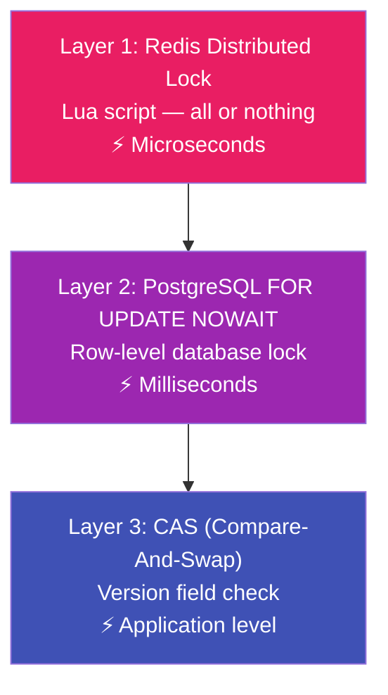
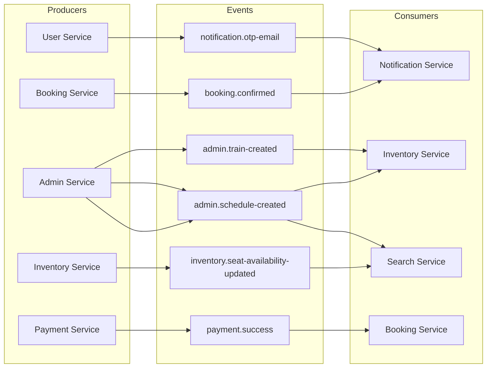
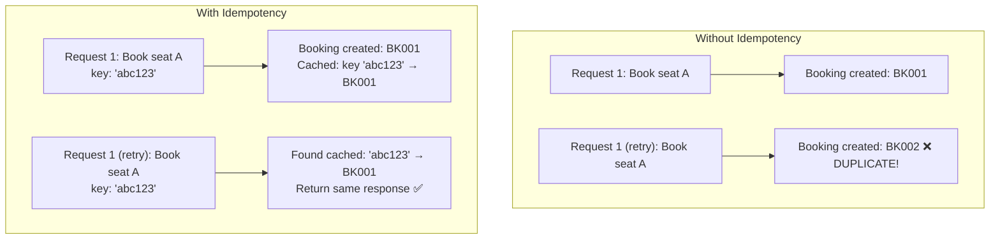
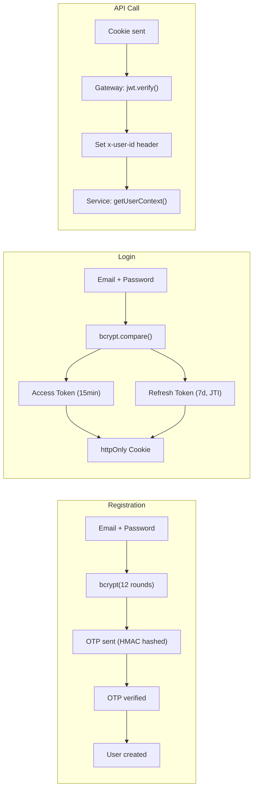

# 🎯 Design Patterns, Concepts & Interview Mastery

> **Yeh chapter interview preparation ka NUCLEAR WEAPON hai. Yaha pe project me use hone wale saare design patterns, distributed systems concepts, aur 100+ interview questions ek jagah hain.**

---

## Table of Contents

1. [Design Patterns Used — Summary Matrix](#design-patterns-used--summary-matrix)
2. [Pattern 1: Saga Pattern (Orchestration)](#pattern-1-saga-pattern-orchestration)
3. [Pattern 2: Distributed Lock (Redis + Lua)](#pattern-2-distributed-lock-redis--lua)
4. [Pattern 3: Optimistic Concurrency Control (CAS)](#pattern-3-optimistic-concurrency-control-cas)
5. [Pattern 4: Strategy + Factory Pattern (Gateway)](#pattern-4-strategy--factory-pattern-gateway)
6. [Pattern 5: Circuit Breaker](#pattern-5-circuit-breaker)
7. [Pattern 6: Token Rotation + Reuse Detection](#pattern-6-token-rotation--reuse-detection)
8. [Pattern 7: Event-Driven Architecture (Kafka)](#pattern-7-event-driven-architecture-kafka)
9. [Pattern 8: Dead Letter Queue (DLQ)](#pattern-8-dead-letter-queue-dlq)
10. [Pattern 9: Cache-Aside](#pattern-9-cache-aside)
11. [Pattern 10: Idempotency](#pattern-10-idempotency)
12. [Pattern 11: Leader Election](#pattern-11-leader-election)
13. [Distributed Systems Concepts](#distributed-systems-concepts)
14. [Database Concepts](#database-concepts)
15. [Security Concepts](#security-concepts)
16. [Interview Questions — Complete Bank](#interview-questions--complete-bank)
17. [System Design Answer Template](#system-design-answer-template)

---

## Design Patterns Used — Summary Matrix

| # | Pattern | Where Used | Problem Solved |
|---|---|---|---|
| 1 | **Saga (Orchestration)** | Booking Service | Distributed transactions across services |
| 2 | **Distributed Lock** | Booking Service (Redis Lua) | Double booking prevention |
| 3 | **Optimistic Concurrency (CAS)** | Booking + Payment Services | Race condition between payment/expiry/cancel |
| 4 | **Strategy + Factory** | Payment Service (Gateways) | Swappable payment providers |
| 5 | **Circuit Breaker** | API Gateway | Cascading failure prevention |
| 6 | **Token Rotation** | User Service | Refresh token theft detection |
| 7 | **Event-Driven** | All Services (Kafka) | Async communication, decoupling |
| 8 | **Dead Letter Queue** | All Consumers | Poison message handling |
| 9 | **Cache-Aside** | User + Booking Services | Reduce DB load |
| 10 | **Idempotency** | Booking + Payment Services | Duplicate request handling |
| 11 | **Leader Election** | Booking Expiry Job | Single-instance background jobs |
| 12 | **Singleton** | Redis, Prisma, Kafka clients | Connection reuse |
| 13 | **Higher-Order Function** | asyncHandler, withDLQ, withIdempotency | Cross-cutting concerns |
| 14 | **Reverse Proxy** | API Gateway | Service abstraction |
| 15 | **Event Enrichment** | Admin Service | Self-contained events |

---

## Pattern 1: Saga Pattern (Orchestration)

### One-Line Definition
"Distributed transaction ko local transactions ki chain me todna, with compensation for rollback."

### When to Use
- Multiple services me data change karna ho
- ACID transaction possible nahi hai (different databases)
- Partial failure handle karna ho

### This Project Me

```
Forward:    HOLD_SEATS → CREATE_PAYMENT → CONFIRM_SEATS
Compensate: RELEASE_SEATS ← REFUND ← CANCEL_SEATS
```

### Interview Script
> "Hum Saga Orchestration pattern use karte hain. Central orchestrator (saga.service.js) step-by-step downstream services ko call karta hai. Har step ka SagaLog DB me record hota hai (audit trail + crash recovery). Agar koi step fail ho toh completed steps reverse order me compensate hote hain. For example, agar payment creation fail ho toh pehle held seats release karte hain."

### Two Types

| Type | Orchestration (Yeh project) | Choreography |
|---|---|---|
| **Control** | Central coordinator | Each service decides |
| **Coupling** | Orchestrator knows all steps | Services independent |
| **Debugging** | Easy (one place to check) | Hard (trace across services) |
| **Failure Handling** | Orchestrator handles | Each service handles |
| **Best For** | Complex flows (3+ steps) | Simple flows (2 steps) |

---

## Pattern 2: Distributed Lock (Redis + Lua)

### One-Line Definition
"Multiple processes me shared resource ko safely access karne ka mechanism."

### This Project Me

```lua
-- All-or-Nothing: Either ALL seats locked, or NONE
for i, key in ipairs(KEYS) do
    local result = redis.call('SET', key, lockValue, 'NX', 'EX', ttl)
    if not result then
        -- Rollback all previously acquired locks
        for j = 1, #acquired do redis.call('DEL', acquired[j]) end
        return 0
    end
end
return 1
```

### Interview Script
> "Double booking prevent karne ke liye Redis distributed lock use karte hain. Lua script atomically ALL seats ko lock karta hai ya NONE ko — partial lock nahi hota. Lock ownership tracking hai (bookingId + timestamp) taaki wrong process lock release na kare. Deadlock prevention ke liye seat IDs sort karte hain before locking. Lock ka TTL hai so even if process crashes, lock eventually expire ho jayega."

### Three Layers of Protection



---

## Pattern 3: Optimistic Concurrency Control (CAS)

### One-Line Definition
"Read time pe version note karo. Write time pe check karo ki version wahi hai? Nahi → someone else changed it → retry ya fail."

### This Project Me

```javascript
const casUpdateBooking = async (bookingId, expectedVersion, data) => {
     const result = await prisma.booking.updateMany({
          where: { id: bookingId, version: expectedVersion },
          data: { ...data, version: { increment: 1 } },
     });
     if (result.count === 0) {
          throw new StaleStateError('Booking modified by another process');
     }
};
```

### Interview Script
> "CAS pattern use karte hain booking status transitions me. Har booking ka version field hai. Update karte waqt WHERE clause me current version check karte hain. Agar version match nahi kare (meaning koi aur process ne beech me modify kiya), toh updateMany returns count=0 → StaleStateError throw hota hai. Yeh 3-way race handle karta hai: payment success, expiry job, aur user cancel — teeno simultaneously booking update karne ki koshish kar sakte hain, lekin sirf ek succeed karega."

### Optimistic vs Pessimistic

| Feature | Optimistic (CAS — this project) | Pessimistic (FOR UPDATE) |
|---|---|---|
| **Lock timing** | Read ke baad, write time pe check | Read time pe hi lock |
| **Contention** | Low contention pe fast | High contention pe efficient |
| **Database load** | Minimal lock overhead | Lock rows → block others |
| **Retry needed** | Yes (StaleStateError pe) | No (waits for lock) |
| **This project** | Booking status transitions | Inventory seat locking |

---

## Pattern 4: Strategy + Factory Pattern (Gateway)

### One-Line Definition
"Algorithm family define karo (Strategy), runtime pe select karo (Factory)."

### This Project Me

```
BaseGateway (abstract)
  ├── RazorpayGateway (implements all methods)
  └── StripeGateway   (future — same interface)

GatewayFactory.getGateway()  → returns correct instance based on config
```

### Interview Script
> "Payment gateways ke liye Strategy + Factory pattern use kiya. BaseGateway abstract class hai jo interface define karta hai — createOrder, verifyPayment, initiateRefund. RazorpayGateway concrete implementation hai. Factory config se decide karta hai kaun sa gateway return karna hai. New gateway add karne ke liye sirf ek class banao aur factory me ek case add karo — business logic me zero changes."

---

## Pattern 5: Circuit Breaker

### One-Line Definition
"Downstream service fail ho rahi hai toh requests directly reject karo — service ko recover hone do."

### State Machine

```
CLOSED (normal) → 5 failures → OPEN (reject all)
OPEN → 60 seconds wait → HALF_OPEN (one test request)
HALF_OPEN → success → CLOSED | failure → OPEN
```

### Interview Script
> "API Gateway me per-service circuit breakers hain. 5 consecutive failures pe circuit opens — all requests to that service immediately get 503. 60 seconds baad HALF_OPEN state me ek test request jaata hai. Success → circuit closes. Failure → circuit opens again. Yeh cascading failure prevent karta hai — agar payment service down hai toh booking service bhi slow na ho."

---

## Pattern 6: Token Rotation + Reuse Detection

### One-Line Definition
"Har refresh pe naya token pair issue karo + purana invalidate karo. Purana token wapas aaye → theft detected."

### Interview Script
> "Refresh Token Rotation with Reuse Detection implement ki hai. Har refresh pe naya access + refresh token pair milta hai, purana refresh token invalid ho jaata hai. Redis me latest JTI (JWT ID) store hai per-device. Agar stolen token use ho (JTI mismatch) → session immediately invalidated. Yeh OAuth 2.0 best practice hai (IETF RFC)."

---

## Pattern 7: Event-Driven Architecture (Kafka)

### One-Line Definition
"Services aapas me asynchronously communicate karti hain events ke through."

### Event Catalog



### Interview Script
> "Event-driven architecture use karte hain Kafka ke saath. Synchronous calls sirf wahi hain jaha immediate response chahiye (booking → inventory lock seats). Baaki sab asynchronous hai (booking confirmed → send email). Producers idempotent hain. Consumers DLQ-wrapped hain — poison messages consumer ko block nahi karti."

---

## Distributed Systems Concepts

### CAP Theorem — This Project Me

| Property | This Project | How? |
|---|---|---|
| **Consistency** | Strong (for bookings) | CAS + DB transactions |
| **Availability** | High (for search) | Elasticsearch eventually consistent |
| **Partition Tolerance** | Yes | Kafka handles network partitions |

**Trade-off**: Booking flow favors consistency (no double booking). Search flow favors availability (slightly stale data OK).

### Eventually Consistent

```
Seat booked in Inventory DB → Kafka event → Search Service → Elasticsearch update
Delay: 100ms-2s

User searches trains → sees "42 available" (actually 41)
User clicks "Book" → Booking Service checks Inventory DIRECTLY (not Elasticsearch)
If seat taken → ConflictError → User tries another seat
```

### Idempotency in Distributed Systems



---

## Database Concepts

### Prisma ORM Patterns Used

| Pattern | Example | Why |
|---|---|---|
| **Nested Create** | `booking.create({ data: { seats: { create: [...] } } })` | Atomic multi-table insert |
| **Interactive Transaction** | `prisma.$transaction(async (tx) => { ... })` | Multi-step atomicity |
| **Raw SQL** | `tx.$queryRaw\`SELECT ... FOR UPDATE NOWAIT\`` | Prisma doesn't support FOR UPDATE |
| **UpdateMany for CAS** | `updateMany({ where: { version: x } })` | Returns count instead of throwing |
| **Conditional Upsert** | Check exists + create/update in tx | Idempotent event handling |

### `FOR UPDATE NOWAIT` vs `FOR UPDATE`

```
FOR UPDATE:
  Thread A: Lock row → processing...
  Thread B: Wait... wait... wait... (user sees loading spinner)
  Thread A: Done → release lock
  Thread B: Got lock → process
  
FOR UPDATE NOWAIT:
  Thread A: Lock row → processing...
  Thread B: Error! Row locked → Immediate 409 response
  Thread B's user sees: "Seat being booked by another user, try again"
  
NOWAIT = Better UX (fast fail) but requires retry logic
```

### Database Indexes in This Project

```prisma
// Booking Service
@@index([userId])                    // "Show my bookings"
@@index([scheduleId])                // "Show all bookings for a train"
@@index([status])                    // "Show all PENDING bookings"
@@index([lockExpiresAt, status])     // "Find expired bookings" (Composite!)

// User Service
email String @unique                 // Unique constraint = automatic index

// Inventory Service
scheduleId String @unique            // Fast lookup by schedule
```

**Composite Index** `[lockExpiresAt, status]`: Expiry job query uses BOTH fields → single index lookup instead of two.

---

## Security Concepts

### Authentication Flow Summary



### Security Measures Matrix

| Threat | Protection | Implementation |
|---|---|---|
| **XSS** | httpOnly cookies | `httpOnly: true` in cookie options |
| **CSRF** | SameSite cookie | `sameSite: 'strict'` in production |
| **Brute Force Login** | Rate limiting | Redis sliding window + endpoint rate limit |
| **OTP Guessing** | Attempt limiting | Max 5 attempts per session |
| **OTP Spam** | Rate limiting | Max 5 OTPs per hour per email |
| **Password Theft** | bcrypt hashing | 12 salt rounds |
| **Token Theft** | Short-lived + rotation | 15 min access + JTI rotation |
| **Timing Attack** | `timingSafeEqual` | OTP verify + webhook signature |
| **Man-in-Middle** | HTTPS + secure cookies | `secure: true` in production |
| **Header Injection** | Helmet.js | XSS filter, content type, etc. |
| **DDoS** | Rate limiting + Circuit breaker | IP + User + Endpoint limits |
| **SQL Injection** | Prisma ORM | Parameterized queries |
| **Double Booking** | Three-layer locking | Redis + DB + CAS |
| **Webhook Tampering** | HMAC signature | `crypto.timingSafeEqual` |

---

## Interview Questions — Complete Bank

### 🟢 Easy (Freshers / 0-2 years)

**1. Microservice architecture kya hai?**
> "Application ko independently deployable services me todna. Har service ek business domain own karti hai (User, Booking, Payment). Independent database, independent deployment, independent scaling."

**2. REST API kya hai?**
> "Client-server communication pattern. HTTP methods (GET, POST, PUT, DELETE) use karta hai. Resources ko URLs se represent karta hai. Stateless hai — har request me saari information hoti hai."

**3. JWT kya hai aur kaise kaam karta hai?**
> "JSON Web Token — stateless authentication. Three parts: Header (algorithm), Payload (user data), Signature (tamper-proof). Server secret key se sign karta hai, verify bhi usi key se. Token me hi information hoti hai, server ko session store nahi karna padta."

**4. ORM kya hai? Prisma kyu use kiya?**
> "Object-Relational Mapping — JavaScript objects ko SQL queries me convert karta hai. Prisma: type-safe queries, automatic migrations, clean API, relation handling."

**5. Middleware kya hota hai Express me?**
> "Request aur response ke beech me function chain. `(req, res, next)` — process karo aur `next()` call karo. Authentication, logging, rate limiting — sab middleware hai."

**6. Environment variables kyu use karte hain?**
> "Secrets (passwords, API keys) code me hardcode nahi karte. Different environments (dev, staging, prod) me different values. `process.env.KEY` se access."

**7. Docker kya hai?**
> "Application ko container me package karta hai — code + dependencies + OS. 'It works on my machine' problem solve karta hai. Consistent environment everywhere."

**8. async/await kya hai?**
> "Asynchronous code ko synchronous style me likhne ka tarika. `async` function hamesha Promise return karta hai. `await` Promise resolve hone tak wait karta hai."

### 🟡 Medium (2-5 years)

**9. Saga pattern kya hai aur kab use karte hain?**
> *See Pattern 1 Interview Script above*

**10. Rate limiting kyu zaroori hai aur kaise implement ki?**
> "DDoS protection, brute force prevention, fair usage. Redis sorted set based sliding window algorithm use kiya. Per-IP, per-user, aur per-endpoint limits hain. Pipeline se 4 Redis commands ek roundtrip me."

**11. Circuit breaker pattern explain karo.**
> *See Pattern 5 Interview Script above*

**12. Event-driven architecture ke pros aur cons?**
> "**Pros**: Loose coupling, independent scaling, fault tolerance (Kafka persists messages). **Cons**: Eventual consistency, debugging harder (distributed tracing chahiye), message ordering guarantees complex."

**13. Optimistic vs Pessimistic locking?**
> *See Pattern 3 table above*

**14. Webhook kya hota hai?**
> "Server-to-server callback. Razorpay payment complete kare toh hamara endpoint call kare. Reverse of polling — hum baar baar check nahi karte, event hone pe Razorpay bata deta hai."

**15. Elasticsearch PostgreSQL se better kaise hai search ke liye?**
> "PostgreSQL: B-tree index → prefix search fast, `LIKE '%text%'` slow (full scan). Elasticsearch: Inverted index → har word indexed → O(1) search. Plus: fuzzy matching, autocomplete, relevance scoring."

**16. Database indexing kya hai aur kab use karte hain?**
> "Index = book ki table of contents. Without index: full table scan (read every row). With index: B-tree lookup (log N). Use on: frequently queried columns, WHERE clause columns, JOIN columns. Don't over-index: each index slows writes."

**17. Idempotency kyu zaroori hai distributed systems me?**
> *See Pattern 10 above*

**18. Dead Letter Queue kya hai?**
> *See Pattern 8 above*

### 🔴 Hard (5+ years / Senior)

**19. Double booking kaise prevent kiya? Saare layers explain karo.**
> "Three layers: (1) Redis distributed lock (Lua, all-or-nothing, TTL) — fast first check. (2) PostgreSQL `FOR UPDATE NOWAIT` — row-level lock, instant fail. (3) CAS with version field — application-level race prevention. Deadlock prevention: sort seat IDs before locking."

**20. Payment success, booking expiry, aur user cancel teeno simultaneously aaye toh?**
> "CAS handle karta hai. Teeno `UPDATE WHERE version=X` try karte hain. Sirf ek WHERE match karega (version same hoga). Baaki do `count=0` get karenge → skip. Transitional states (CONFIRMING, CANCELLING) additional protection dete hain — expiry job CONFIRMING state wali booking ko touch nahi karega."

**21. Kafka me message ordering guarantee kaise karte hain?**
> "Same partition = ordered. Hum message key use karte hain (e.g., `booking-BK001`). Same booking ke sab messages same partition me jayenge → ordering guaranteed. Cross-booking ordering guarantee nahi hai, lekin chahiye bhi nahi."

**22. System me consistency vs availability trade-off kaha kiya?**
> "Booking flow: Consistency > Availability (no double booking). Search flow: Availability > Consistency (stale data OK, eventual consistency Kafka se). User data: Cache-aside with TTL — slightly stale profile OK."

**23. Server crash ke baad recovery kaise hoga?**
> "Kafka: Consumer offsets committed after processing → unprocessed messages re-delivered. Redis locks: TTL-based → auto-expire. Booking expiry job: Leader election → surviving instance takes over. SagaLog: Completed steps recorded → compensation possible."

**24. Agar Kafka down ho jaaye toh kya hoga?**
> "Booking flow: Synchronous HTTP calls still work (hold seats, create payment). But: Payment success event nahi jayega booking service ko. Mitigation: Client-side verify-payment endpoint bhi hai (fallback). Booking expiry job expired bookings clean karegi. System eventually consistent ho jayega Kafka recovery pe."

**25. System ko 10x scale karna ho toh kya karoge?**
> "1. Kafka partitions increase karo → parallel consumers. 2. Booking service horizontally scale karo (stateless except leader election). 3. Redis cluster mode. 4. PostgreSQL read replicas (search queries). 5. Elasticsearch sharding. 6. API Gateway load balancing. 7. CDN for static assets."

**26. Segment booking me overlapping segments ka complete lifecycle explain karo.**
> "Lock: `SeatSegmentLock` table me row create hoto with `fromSeq`, `toSeq`. Overlap check: SQL `WHERE fromSeq < toSeq AND toSeq > fromSeq`. Non-overlapping segments = different rows = no conflict. Confirm: `LOCKED → BOOKED`. Recompute: seat summary status from all segment locks. Cancel: delete segment lock rows + recompute."

---

## System Design Answer Template

Jab interview me "Design a ticket booking system" puche, toh yeh template follow karo:

### Step 1: Requirements (2 min)
```
Functional: Search trains, book tickets, pay, cancel, notify
Non-functional: 
  - No double booking (consistency)
  - Handle 100K concurrent users
  - Payment failure recovery
  - Real-time availability (or near-real-time)
```

### Step 2: High-Level Design (3 min)
```
Client → API Gateway → Microservices
  - User Service (auth)
  - Search Service (Elasticsearch)
  - Booking Service (saga orchestrator)
  - Payment Service (Razorpay/Stripe)
  - Inventory Service (seat management)
  - Notification Service (emails)
Infrastructure: PostgreSQL, Redis, Kafka, Elasticsearch
```

### Step 3: Deep Dive (10 min — pick what interviewer asks)
```
"How do you prevent double booking?"
→ Three-layer locking (Redis → DB → CAS)

"How do you handle payment failures?"
→ Saga pattern with compensation

"How do services communicate?"
→ Sync (HTTP) for immediate needs, Async (Kafka) for events

"How do you scale?"
→ Stateless services, Kafka partitions, Redis cluster, DB read replicas
```

### Step 4: Trade-offs (2 min)
```
"Why not monolith?"
→ Different scaling needs, team independence, fault isolation

"Why Kafka over RabbitMQ?"
→ Log-based persistence, replay, high throughput

"Why Redis locks over DB locks?"
→ Speed (sub-ms), auto-expiry (TTL), cross-service
```

---

## Quick Reference — Common Patterns Cheat Sheet

```
┌─────────────────────────────────────────────────────────────────┐
│                    IRCTC PATTERN CHEAT SHEET                     │
├─────────────────────────────────────────────────────────────────┤
│                                                                  │
│  asyncHandler(fn)        → Auto try-catch for Express            │
│  withDLQ(handler)        → Auto retry + dead letter queue        │
│  withIdempotency(key,fn) → Skip if already processed             │
│  casUpdateBooking(id,v)  → Compare-and-swap with version         │
│  withRetry(fn, max)      → Exponential backoff retry             │
│                                                                  │
│  Redis Keys:                                                     │
│    otp:session:{uuid}          → OTP data (5min TTL)             │
│    otp:rate:{email}            → OTP rate limit (1hr)            │
│    refresh:{userId}:{device}   → JWT rotation JTI (7d)           │
│    user:{userId}               → Profile cache                   │
│    ratelimit:ip:{ip}           → Gateway rate limit              │
│    booking:lock:seat:{s}:{id}  → Distributed seat lock           │
│    booking:expiry-job:leader   → Leader election (25s)           │
│                                                                  │
│  Kafka Topics:                                                   │
│    notification.otp-email      → US → NS                         │
│    admin.schedule-created      → AS → IS, SS                     │
│    payment.success             → PS → BS                         │
│    booking.confirmed           → BS → NS                         │
│    inventory.seat-availability → IS → SS                         │
│    dlq.{service-name}          → Dead letter queue               │
│                                                                  │
│  HTTP Status Quick Reference:                                    │
│    200 OK, 201 Created, 400 Bad Request, 401 Unauthorized        │
│    403 Forbidden, 404 Not Found, 409 Conflict                    │
│    429 Too Many Requests, 500 Server Error, 503 Unavailable      │
│                                                                  │
│  Security Quick Reference:                                       │
│    bcrypt.hash(pw, 12)              → Password hashing           │
│    crypto.timingSafeEqual(a, b)     → Timing attack prevention   │
│    crypto.createHmac('sha256', key) → HMAC signature             │
│    httpOnly: true                    → XSS prevention            │
│    sameSite: 'strict'               → CSRF prevention            │
│    helmet()                         → Security headers           │
│    express.raw()                    → Webhook raw body           │
│                                                                  │
└─────────────────────────────────────────────────────────────────┘
```

---

## Final Words

Bhai, yeh notes padhke agar tu interview me jaaye toh interviewer impress ho jayega. Key points yaad rakh:

1. **"Kyu?"** — Har pattern ke peeche ek REASON hai. "Redis lock isliye use kiya kyunki cross-service hai aur sub-millisecond speed chahiye" — yeh answer interviewer sunna chahta hai.

2. **Trade-offs bata** — "CAS optimistic hai, low contention pe fast hai, high contention pe retries zyada honge" — yeh maturity dikhata hai.

3. **Real numbers de** — "Access token 15 minutes, bcrypt 12 rounds (~250ms), rate limit 100 requests per 15 minutes" — yeh production experience dikhata hai.

4. **Three-layer thinking** — "First Redis lock, then DB lock, then CAS" — multiple layers of defense dikhata hai ki tu edge cases sochta hai.

5. **Failure scenarios soch** — "Agar Kafka down ho, agar Redis crash ho, agar network partition ho" — yeh senior engineer ki soch hai.

**Best of luck! 🚀**

---

> **[Back to Overview](./00_project_overview_and_architecture.md)** | **[API Gateway](./01_api_gateway.md)** | **[Booking Service](./02_booking_service.md)** | **[Payment Service](./03_payment_service.md)** | **[Other Services](./04_inventory_search_notification_admin.md)** | **[User Service](./05_user_service.md)**
